<div align="center">

<a href="https://ci.computer/hub">
  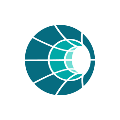
</a>

# Companion Hub

**Your own AI server, on the computer you already own.**

Install self-hosted apps, local models, and AI agents in one click, and run them side by side on a Mac, PC, or Linux box.
Your apps, your models, and your data stay on your hardware.

[](https://github.com/companionintelligence/CI-Hub/releases/latest)
[](https://docs.ci.computer)
[](https://docs.ci.computer/docs/getting-started/system-requirements)
[](LICENSE.md)
[](https://discord.com/invite/yQp9hwpzAa)

**[Website](https://ci.computer/hub)** ·
**[Documentation](https://docs.ci.computer)** ·
**[Download](https://github.com/companionintelligence/CI-Hub/releases/latest)** ·
**[App catalog](https://docs.ci.computer/docs/apps-available)** ·
**[Your first hour](https://docs.ci.computer/docs/getting-started/first-hour)**

<br>

<a href="docs/images/readme/hub-tour.mp4">
  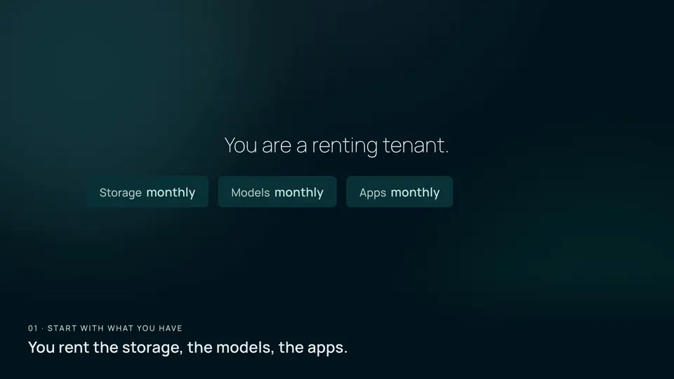
</a>

<sub>▶ A thirty-second tour. Select it for the version with sound.</sub>

</div>

---

## What is Companion Hub?

Companion Hub is the local app runtime of the [Companion Intelligence](https://ci.computer) platform. It installs and supervises apps as Docker Compose deployments, and gives you a web dashboard, a desktop app, and a `cihub` CLI to run them.

You can put almost anything in a container and run it here. A whole guest OS. A wealth dashboard you wrote in two prompts. A git repo you just cloned. Hub installs it, watches it, and puts it next to everything else you already run. That is the multi-app world, in one interface, on hardware you can see.

Hub is the data cube. Your data nugget server. The core is free to inspect and run for personal and nonprofit use.

## Screenshots

<table>
  <tr>
    <td width="50%" valign="top">
      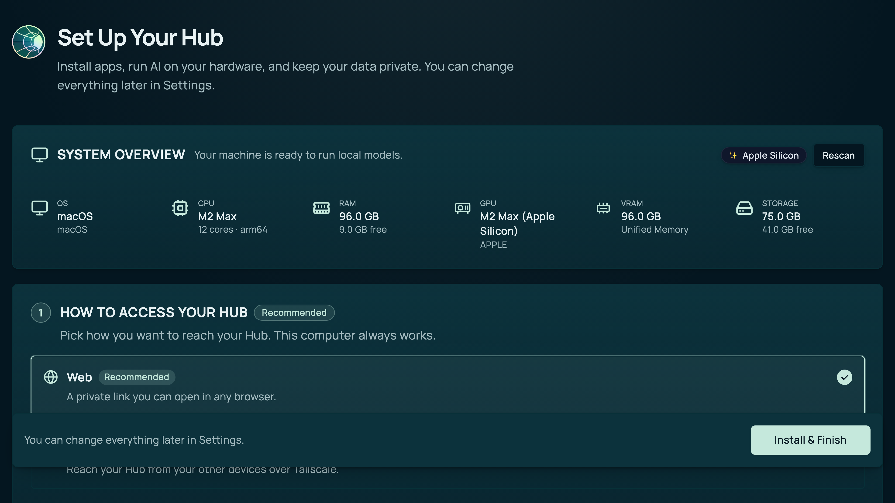
      <p align="center"><b>One wizard sets up the machine</b></p>
    </td>
    <td width="50%" valign="top">
      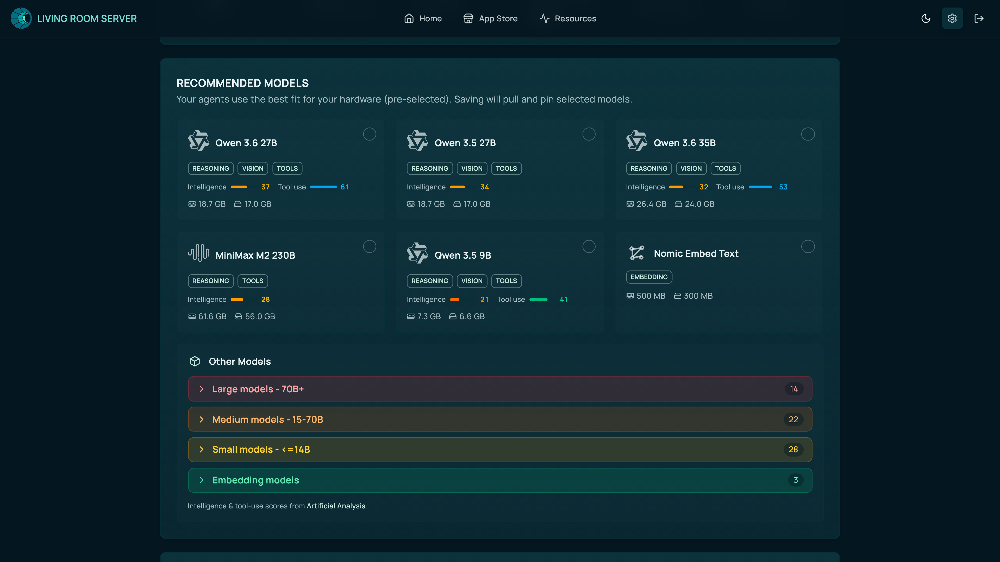
      <p align="center"><b>Models picked for your hardware</b></p>
    </td>
  </tr>
  <tr>
    <td width="50%" valign="top">
      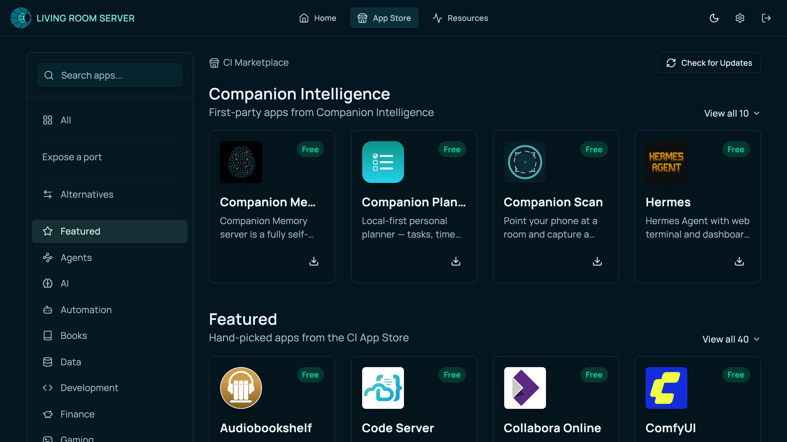
      <p align="center"><b>An app store for your own server</b></p>
    </td>
    <td width="50%" valign="top">
      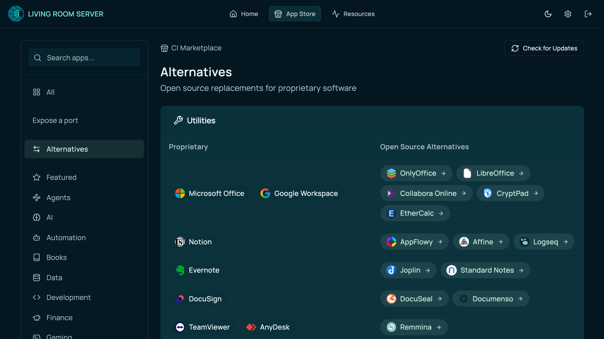
      <p align="center"><b>Open-source swaps for what you rent</b></p>
    </td>
  </tr>
  <tr>
    <td width="50%" valign="top">
      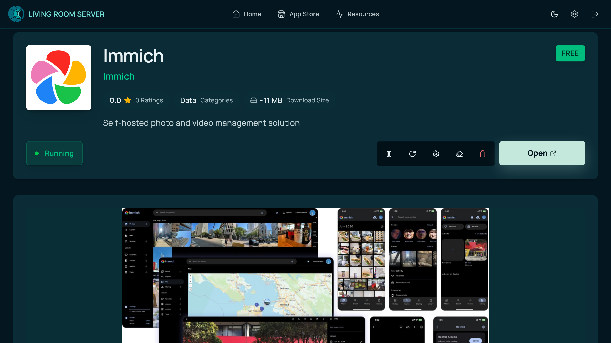
      <p align="center"><b>Installed, running, and yours</b></p>
    </td>
    <td width="50%" valign="top">
      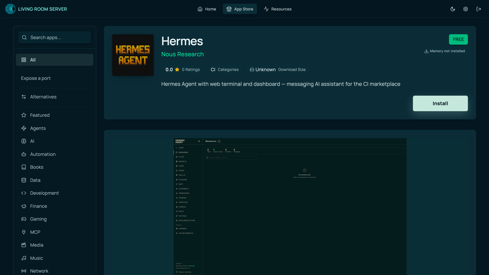
      <p align="center"><b>Agents install like any other app</b></p>
    </td>
  </tr>
  <tr>
    <td width="50%" valign="top">
      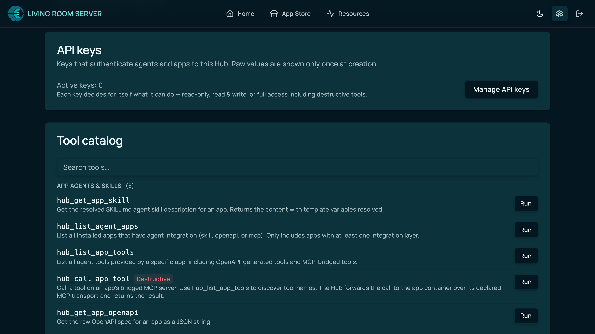
      <p align="center"><b>One MCP surface for every app</b></p>
    </td>
    <td width="50%" valign="top">
      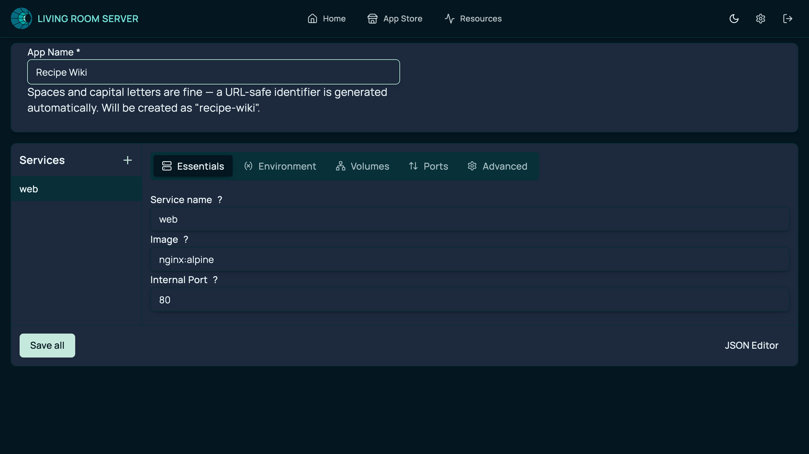
      <p align="center"><b>Bring your own container</b></p>
    </td>
  </tr>
</table>

## Features

Hub is not a single app. It is the layer that holds the rest together.

<table>
  <tr>
    <td width="50%" valign="top">
      <h3>🛍️ App store for your own server</h3>
      One-click installs from the Companion Intelligence marketplace, with open-source alternatives for the services you pay for today.
      <br><a href="https://docs.ci.computer/docs/features/app-store">App store</a> · <a href="https://docs.ci.computer/docs/features/alternatives">Alternatives</a>
    </td>
    <td width="50%" valign="top">
      <h3>🧠 Local AI that fits the box</h3>
      Onboarding reads your CPU, GPU, memory, and storage, then recommends models that fit. Voice, text, and image share one queue so they do not stampede the machine.
      <br><a href="https://docs.ci.computer/docs/features/inference-and-ai">AI and inference</a>
    </td>
  </tr>
  <tr>
    <td width="50%" valign="top">
      <h3>🤖 Agents with a home</h3>
      OpenClaw, Hermes, and other agents install like any app. They read one shared <a href="https://docs.ci.computer/docs/companion-memory">Companion Memory</a> instead of each keeping a private scrapbook.
      <br><a href="https://docs.ci.computer/docs/tutorials/run-your-first-agent">Run your first agent</a>
    </td>
    <td width="50%" valign="top">
      <h3>🔌 MCP nexus</h3>
      Hub serves one Model Context Protocol endpoint. Agents discover, install, and drive every app through a single tool surface.
      <br><a href="https://docs.ci.computer/docs/connect/hub-mcp">Companion Hub MCP</a>
    </td>
  </tr>
  <tr>
    <td width="50%" valign="top">
      <h3>📦 Bring your own container</h3>
      Marketplace apps, custom Compose, and git repos you bring. Apps on apps are allowed. A server in a server is allowed.
      <br><a href="https://docs.ci.computer/docs/tutorials/publish-your-first-app">Publish your first app</a>
    </td>
    <td width="50%" valign="top">
      <h3>🌐 Reach it your way</h3>
      Keep each app on this machine, share it over a private Tailscale network, or publish it to the web through Cloudflare.
      <br><a href="https://docs.ci.computer/docs/networking">Networking</a> · <a href="https://docs.ci.computer/docs/tutorials/reach-your-hub-from-your-phone">From your phone</a>
    </td>
  </tr>
  <tr>
    <td width="50%" valign="top">
      <h3>🔗 Pool your machines</h3>
      Pair more than one Hub over Tailscale and they share inference work by queue depth.
      <br><a href="https://docs.ci.computer/docs/networking/hub-pool">Hub Pool</a>
    </td>
    <td width="50%" valign="top">
      <h3>🔑 OpenAI-compatible API</h3>
      Point Cursor, Continue, Cline, Aider, Zed, or an OpenAI SDK at your Hub, and keep the engines you already run.
      <br><a href="#connect-your-tools">Connect your tools</a>
    </td>
  </tr>
</table>

## Install

**Prerequisites:** [Docker](https://docs.ci.computer/docs/getting-started/installing-docker) is required. Install [Ollama](https://docs.ci.computer/docs/getting-started/installing-ollama) too if you want local models. Check the [system requirements](https://docs.ci.computer/docs/getting-started/system-requirements) for hardware.

<p>
  <a href="https://github.com/companionintelligence/CI-Hub/releases/latest"><picture><source media="(prefers-color-scheme: dark)" srcset="docs/images/readme/download/macos-arm64-company-dark.svg"></picture></a>
  <a href="https://github.com/companionintelligence/CI-Hub/releases/latest"><picture><source media="(prefers-color-scheme: dark)" srcset="docs/images/readme/download/macos-intel-company-dark.svg"></picture></a>
  <a href="https://github.com/companionintelligence/CI-Hub/releases/latest"><picture><source media="(prefers-color-scheme: dark)" srcset="docs/images/readme/download/windows-company-dark.svg"></picture></a>
  <a href="https://github.com/companionintelligence/CI-Hub/releases/latest"><picture><source media="(prefers-color-scheme: dark)" srcset="docs/images/readme/download/debian-deb-company-dark.svg"></picture></a>
</p>

Or install from a package manager:

```bash
# macOS (Homebrew)
brew tap companionintelligence/homebrew-tap
brew trust companionintelligence/homebrew-tap   # first time only, on recent Homebrew
brew install --cask companion-hub

# Windows x64 (Scoop)
scoop bucket add companionintelligence https://github.com/companionintelligence/scoop-bucket
scoop install companion-hub
```

Open Companion Hub. The setup wizard runs on first launch, starts the Docker stack, and opens the dashboard at `http://localhost:5002`.

<details>
<summary><b>Linux server or VPS (headless)</b></summary>

<br>

Install the same Linux package from [GitHub Releases](https://github.com/companionintelligence/CI-Hub/releases/latest) and start the stack without a window:

```bash
curl -fsSL https://get.docker.com | sh          # if Docker is not installed
sudo dpkg -i Companion.Hub_*_amd64.deb          # or the .rpm / arm64 build
companion-hub --detached
```

Then open `http://<server-ip>:5002`. On a public server, prefer [Tailscale](https://docs.ci.computer/docs/networking/tailscale) or the [Cloudflare Gateway](https://docs.ci.computer/docs/networking/cloudflare-gateway) over open ports.

</details>

After install, [create your admin account](https://docs.ci.computer/docs/getting-started/first-login), finish the [onboarding wizard](https://docs.ci.computer/docs/getting-started/onboarding-wizard), and [pair the Hub with your CI Account](https://docs.ci.computer/docs/portal/device-pairing). The full walkthrough is **[Installation](https://docs.ci.computer/docs/getting-started/installation)**, or **[Your first hour](https://docs.ci.computer/docs/getting-started/first-hour)** for one end-to-end page.

## Command line

The desktop app bundles the `cihub` CLI and copies it into your user `bin` directory on first launch, so the Hub is scriptable from any terminal.


```bash
cihub wizard                                       # launch, configure, and register in one guided flow
cihub up --detached                                # start the Hub stack
cihub status                                       # containers, tunnel, VPN, and models
cihub app add my-app nginx:alpine --port 8080:80   # run any image next to your apps
cihub api-key create --scope inference             # a key for your editor or SDK
```

See the [CLI reference](https://docs.ci.computer/docs/getting-started/using-the-cli), or [`docs/CLI.md`](docs/CLI.md) for every command.

## Connect your tools

Hub speaks the OpenAI API and the Ollama native API. Create an `inference`-scoped key in **Settings → Security** (or `cihub api-key create --scope inference`) and point any OpenAI-compatible client at:

```text
http://<hub-host>:5002/api/inference/v1      model: "auto"
```

The key reaches the inference routes and nothing else. If you already run `llama-server` or LM Studio, set `LLAMACPP_URL` or `LMSTUDIO_URL` and the Hub serves from it rather than asking you to switch engines. See [`docs/editor-inference.md`](docs/editor-inference.md).

Agents connect over MCP. Claude Code, OpenClaw, Hermes, and any client that speaks Streamable HTTP can manage the Hub and read Companion Memory. See **[Connect an agent](https://docs.ci.computer/docs/connect)**.

## How it fits together

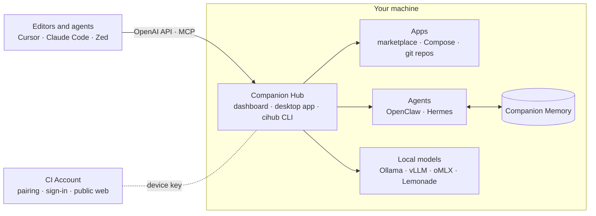

Hub runs on your hardware. The [CI Account](https://docs.ci.computer/docs/portal) is the door for sign-in, the public web, and paid capacity. Add-ons are not a lock on this repo. Read the [architecture reference](https://docs.ci.computer/docs/reference/architecture) for the full picture.

## Documentation

User documentation lives at **[docs.ci.computer](https://docs.ci.computer)**.

| Start here | Go further | Look it up |
|---|---|---|
| [Introduction](https://docs.ci.computer/docs/introduction) | [Connect an agent](https://docs.ci.computer/docs/connect) | [Reference](https://docs.ci.computer/docs/reference) |
| [Installation](https://docs.ci.computer/docs/getting-started/installation) | [Networking](https://docs.ci.computer/docs/networking) | [Environment variables](https://docs.ci.computer/docs/reference/environment-variables) |
| [Your first hour](https://docs.ci.computer/docs/getting-started/first-hour) | [Guides](https://docs.ci.computer/docs/guides) | [Troubleshooting](https://docs.ci.computer/docs/troubleshooting) |
| [Tutorials](https://docs.ci.computer/docs/tutorials) | [App catalog](https://docs.ci.computer/docs/apps-available) | [Getting help](https://docs.ci.computer/docs/troubleshooting/getting-help) |

Engineering notes for this repository live in [`docs/`](docs/). Start with the doc map in [`docs/README.md`](docs/README.md).

## Security and privacy

- **Hub and Portal.** Open-source Hub is an untrusted client of Companion Portal. Marketplace installs and registry tag lists need a Portal-issued device key, so pair first (`cihub register` or the onboarding UI). An unpaired Hub gets `401` on those calls, and the catalog can look slow or empty instead of obviously unauthorized. See [`docs/security/hub-portal-trust.md`](docs/security/hub-portal-trust.md).
- **Telemetry.** Distributed builds report crashes to Sentry by default. `CI_TELEMETRY=off` or `CI_LOCAL_ONLY=true` in the Hub `.env` stops it, as does the switch in **Settings → General**. What is collected, and what is not, is in [`docs/telemetry.md`](docs/telemetry.md).

## Contributing

```bash
pnpm install
pnpm run local
```

`pnpm install` is enough to build and run the web stack. The desktop app needs GTK and WebKit headers. That failure and its fix are in [`docs/DEVELOPMENT_SETUP.md`](docs/DEVELOPMENT_SETUP.md).

- [`CONTRIBUTING.md`](CONTRIBUTING.md): issues, pull requests, code structure, and screenshots
- [Running locally](https://docs.ci.computer/docs/contributing/running-locally) and [running the CLI locally](https://docs.ci.computer/docs/contributing/running-the-cli-locally)
- [Submit an app to the store](https://docs.ci.computer/docs/contributing/submitting-to-marketplace)
- [`CLAUDE.md`](CLAUDE.md) and [`AGENTS.md`](AGENTS.md): day-to-day commands for people and coding agents

## Community

[Discord](https://discord.com/invite/yQp9hwpzAa) · [YouTube](https://youtube.com/@companionintelligence) · [X](https://x.com/companionintel) · [LinkedIn](https://www.linkedin.com/company/companionintelligence/)

## License

Companion Hub uses the [PolyForm Noncommercial License 1.0.0](https://polyformproject.org/licenses/noncommercial/1.0.0). You can use, modify, and redistribute it for personal and nonprofit purposes. For common questions, see the [License FAQ](docs/License-FAQ.md) or email support@companionintelligence.com.

- License text: [`LICENSE.md`](LICENSE.md)
- License FAQ: [`docs/License-FAQ.md`](docs/License-FAQ.md)

Required Notice: Copyright LifeScope INC, DBA Companion Intelligence (https://ci.computer)

Companion Hub is derived from [Runtipi](https://github.com/runtipi/runtipi), and would not exist without it. See [`NOTICE.md`](NOTICE.md) and [`CREDITS.md`](CREDITS.md).

<br>

<div align="center">

> *You never change things by fighting the existing reality. To change something, build a new model that makes the existing model obsolete.*
>
> R. Buckminster Fuller

</div>
