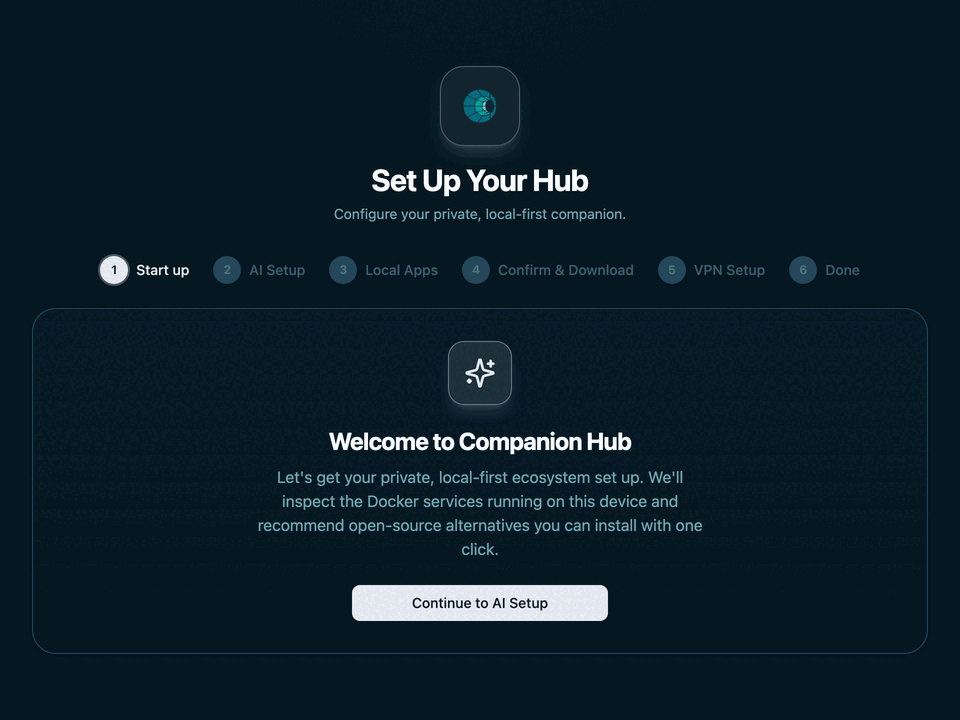
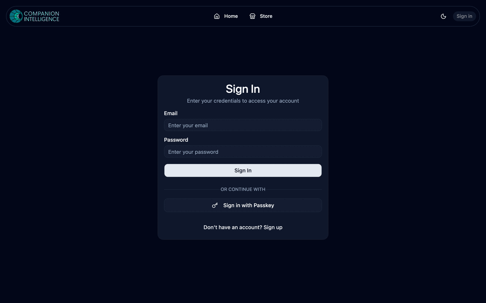

<p align="center">
  
</p>

# [Companion Hub](https://ci.computer/hub)

**Self-hosted app platform.** Install and manage Docker apps from the Companion Intelligence marketplace with one click. Your machine, your data.

Part of the [CI OS](https://github.com/companionintelligence) ecosystem. Licensed under [GNU Affero General Public License](LICENSE).

---

## Features

- **One-click app installs** — Browse the app store, pick an app, configure it via a dynamic form, and it's running in seconds
- **Automatic reverse proxy** — Every app gets its own subdomain via Traefik with automatic TLS
- **Cloudflare Tunnel** — Optionally expose your hub and apps to the internet through CI Cloud
- **Private VPN** — Built-in Headscale/Tailscale support for encrypted peer-to-peer remote access
- **Desktop app** — Native Tauri app for macOS, Windows, and Linux with system tray, mDNS discovery, and deep linking
- **Real-time status** — Server-Sent Events stream app logs and status changes live to the dashboard
- **Backup & restore** — Per-app backup/restore via compressed archives with configurable retention
- **Custom apps** — Define your own Docker Compose apps directly in the Hub UI
- **Multi-language** — i18n support with community translations via Crowdin
- **Two-factor auth** — TOTP-based 2FA, Argon2 password hashing, JWT sessions

---

## CI-Portal — Cloud Control Plane

<p align="center">
  
</p>

[CI-Portal](https://github.com/companionintelligence/CI-Portal) is the cloud-hosted companion to CI-Hub — providing OIDC identity, device registry, marketplace distribution, and a unified app launcher so you can reach all your self-hosted apps from any browser.

---

## Tech Stack

| Layer | Technologies |
|-------|-------------|
| **Backend** | NestJS 11, Drizzle ORM, PostgreSQL 14, RabbitMQ 4, Zod, Winston |
| **Frontend** | React 19, React Router 7, TanStack Query, Zustand, Tailwind CSS 4, Radix UI |
| **Desktop** | Tauri 2 (Rust), deep linking (`cihub://`), mDNS hub discovery |
| **Infrastructure** | Docker Compose, Traefik v3, Cloudflare Tunnel, Headscale, Tailscale |
| **Tooling** | TypeScript 5, pnpm workspaces, Turborepo, Biome, Playwright, Vitest |
| **CI/CD** | GitHub Actions, GHCR image registry, Cloudflare Workers (Durable Objects) |

---

## Project Structure

```
packages/
  backend/      NestJS API — app lifecycle, Docker management, auth, queue workers
  frontend/     React SPA — dashboard, app store, settings, real-time logs
  common/       Shared Zod schemas, TypeScript types, app URN utilities
  desktop/      Tauri native wrapper — system tray, Docker checks, hub discovery
scripts/        Dev tooling — start, cleanup, e2e runner, app scaffolding, fleet QA
e2e/            Playwright end-to-end tests (auth, apps, lifecycle, settings)
docs/           Supplementary documentation
tunnel/         Cloudflare tunnel token and certificates
```

> For a deep dive into how the Hub works internally, see **[docs/ARCHITECTURE.md](docs/ARCHITECTURE.md)**.
> For how the Hub, Portal, and App Store work together as a platform, see **[docs/PLATFORM_ARCHITECTURE.md](docs/PLATFORM_ARCHITECTURE.md)**.
> For how the Hub brings itself up and keeps itself running, see **[docs/AUTO_HEALING.md](docs/AUTO_HEALING.md)**.

---

## Requirements

| Requirement | Purpose |
|-------------|---------|
| **Docker** (v28+) | Runs the hub and all installed apps |
| **Docker Compose** | Orchestrates services |
| **pnpm** (v10+) and **Node** (v22+) | Local development and scripts |

- [Install Docker Engine](https://docs.docker.com/engine/install/)
- [Install pnpm](https://pnpm.io/installation) and Node 22+

---

## Quick Start

### 1. Clone

```bash
git clone https://github.com/companionintelligence/CI-OS-Hub.git
cd CI-OS-Hub
```

### 2. Configure

```bash
cp .env.example .env.prod
```

Set at minimum:

- **`ROOT_FOLDER_HOST`** — Absolute path for persistent data (e.g. `/opt/ci-os-hub/data`)
- **`JWT_SECRET`** — Random secret (`openssl rand -hex 32`)

### 3. Run

```bash
pnpm start:prod
```

Open **<http://localhost:5002>**. Register your device with CI Cloud on first run, then install apps from the store.

---

## CLI / TUI

The packaged executable is **`cihub`**. It auto-detects first-time setup and shows a guided FTUE wizard.

```bash
cihub wizard              # guided first-time setup (FTUE) or action menu
cihub status              # show running containers + resolved config
cihub up                  # start the Hub stack
cihub app status          # color-coded container health
cihub app logs <name>     # stream container logs
cihub --help              # full command reference
```

Install:

```bash
npm install -g ci-hub
npx --package ci-hub cihub --help
```

Homebrew and other package managers expose the same `cihub` executable on `PATH`.

See **[docs/CLI.md](docs/CLI.md)** for the full reference.

---

## Development

```bash
pnpm install
cp .env.example .env.local
# Edit .env.local — set ROOT_FOLDER_HOST, JWT_SECRET
pnpm run local
```

- **Frontend:** <http://localhost:5173>
- **Backend API:** <http://localhost:3000>

Infrastructure (PostgreSQL, RabbitMQ) runs in Docker; backend and frontend run locally with hot reload.

| Command | Description |
|---------|-------------|
| `pnpm run local` | Start infra + backend + frontend with hot reload |
| `pnpm run dev` | Start the `.env.dev` appliance stack in detached mode |
| `pnpm start dev` | Start the `.env.dev` appliance stack via the shared start entrypoint |
| `cihub wizard [env]` | Guided first-time setup or action menu |
| `cihub status [env]` | Show running containers + resolved config |
| `cihub up [env] [--detached]` | Start the hub stack |
| `cihub down [env]` | Stop the hub stack |
| `cihub restart [env]` | Restart the hub stack |
| `cihub recreate [env]` | Reset runtime state for the environment, then start again |
| `cihub setup [env]` | Initialize Traefik and Docker auth config |
| `cihub register [env]` | Print cloud portal registration URL |
| `cihub doctor [env]` | Validate Docker, env files, bind mounts, and compose inputs |
| `cihub reset [env] [--yes]` | Remove runtime state for one environment |
| `cihub uninstall [--yes]` | Full machine cleanup of CI-Hub runtime state |
| `cihub app status [name]` | Color-coded container health |
| `cihub app logs <name>` | Stream container logs |
| `cihub app inspect <name>` | Show container ports, env, mounts |
| `cihub app list\|add\|edit\|start\|stop\|restart\|delete` | Container lifecycle |
| `cihub mcp setup\|shutdown\|config [env]` | MCP lifecycle commands |
| `cihub man` | Manual-style CLI reference |
| `cihub --help` | Full command reference |
| `pnpm run test:cli` | CLI/TUI presentation tests (25 cases) |
| `pnpm run build` | Build all packages via Turborepo |
| `pnpm run test` | Unit tests |
| `pnpm test:e2e` | Playwright end-to-end tests |
| `pnpm dev:desktop` | Launch Tauri desktop app in dev mode |

### Uninstall Cleanup Behavior

> **Uninstall is a full purge.** Unlike most package managers, where `remove` keeps
> your data and only `purge` deletes it, uninstalling Companion Hub through **any**
> channel (`apt remove`, `dnf remove`, `pacman -R`, `choco uninstall`, `snap remove`,
> AUR removal, etc.) **permanently deletes all Hub data** — including the Postgres
> database (`ci_hub_pgdata`), app data (`ci_hub_app_data`), and Tailscale state
> (`hub_tailscale_state`). This is intentional ([#566](https://github.com/companionintelligence/CI-Hub/issues/566)).
> **Back up anything you need before uninstalling — there is no undo and no prompt.**

A Companion Hub uninstall removes, by default:

- Docker resources for Hub stacks — containers, **data volumes** (DB/app/tailscale state), networks, **and pulled/built images**
- **All installed marketplace apps** — every app Hub installed runs as its own Compose project (`<app>_<store>`, tagged `ci-os-hub.managed=true`); uninstall tears down each app's containers, networks, volumes, **and images** too
- Hub state under user data/config/cache directories
- Registry/deep-link entries where package managers support it

Image removal is best-effort: an image still referenced by another (non-Hub) container is skipped, so a base image shared with an unrelated workload is left alone.

**Updates never purge data.** In-place upgrades (the in-app updater, `apt`/`dnf`
upgrades, `scoop update`, etc.) preserve all volumes and state — only a deliberate
uninstall purges. The Scoop channel is a special case: because Scoop runs its
uninstaller during `scoop update` too, the Scoop uninstaller intentionally removes
only containers/networks and leaves data **and images** intact (re-pulling images on
every update would be needlessly slow). For a full purge of a Scoop install, run
`distribution/scripts/uninstall-cleanup.ps1` manually after `scoop uninstall`.

Developer cleanup remains available via:

```bash
cihub reset local --yes
cihub uninstall --yes
```

Warning: reset and uninstall can remove persistent Hub data and Docker volumes (for example, database state).

Environments: `local` (default), `dev`, `staging`, `prod`.

On-device CLI/TUI iteration loop:

```bash
cihub reset local --yes
cihub up local
pnpm run test:cli
```

See [e2e/README.md](e2e/README.md) for the E2E test matrix, including the AI-driven App Explorer Test.

---

## Networking

### Cloudflare Tunnel (optional)

Register your device with CI Cloud in the hub UI. CI Cloud provisions a tunnel and the hub writes the token to `tunnel/token` automatically. For local dev:

```bash
echo "YOUR_TUNNEL_TOKEN" > tunnel/token
./scripts/generate-tunnel-certs.sh   # HTTPS certs for local tunnel
```

### Private VPN (Tailscale, optional)

Use Tailscale when you want private remote access to the Hub and its apps without exposing them publicly.

- Set up Tailscale from the onboarding flow or **Settings → Network**
- Use **`TAILSCALE_AUTHKEY`** for unattended deployments
- Access the Hub with its Tailscale hostname and expose apps privately with the **Tailscale** exposure mode

See **[docs/private-vpn.md](docs/private-vpn.md)** for setup, URL examples, troubleshooting, and the recommended remote administration workflow.

---

## Data Layout

```
$ROOT_FOLDER_HOST/
  apps/          Installed app definitions (docker-compose files)
  app-data/      Per-app persistent data volumes
  repos/         App store git repositories
  state/         Traefik config, Headscale state, TLS certs
  backups/       Compressed app backup archives
  logs/          Application logs
  user-config/   Per-app user overrides
  media/         Uploaded media
```

**Update the hub:** `./scripts/updater/update.sh`

---

## Related Projects

- **[CI App Store](https://github.com/companionintelligence/CI-App-Store)** — Open-source app catalog
- **[CI Portal](https://github.com/companionintelligence/CI-Portal)** — Cloud portal for device registration, tunnel management, and the marketplace API
- **[CI Launcher](https://github.com/companionintelligence/companionintelligence.github.io)** — Web launcher for Hub

---

## License

[GNU Affero General Public License](LICENSE) — Use, modify, and share. Derivatives must remain open source.
