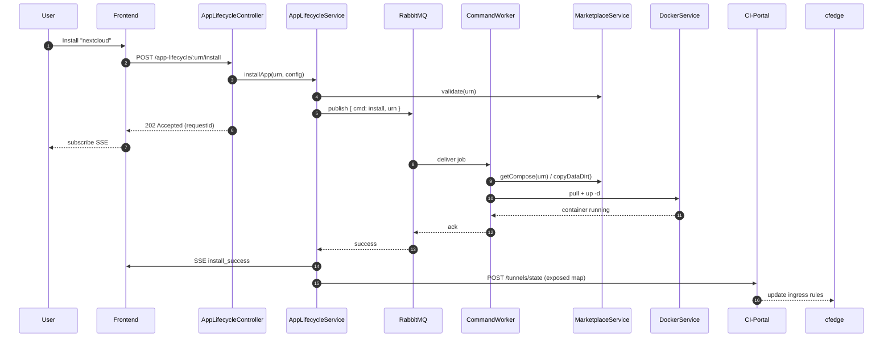
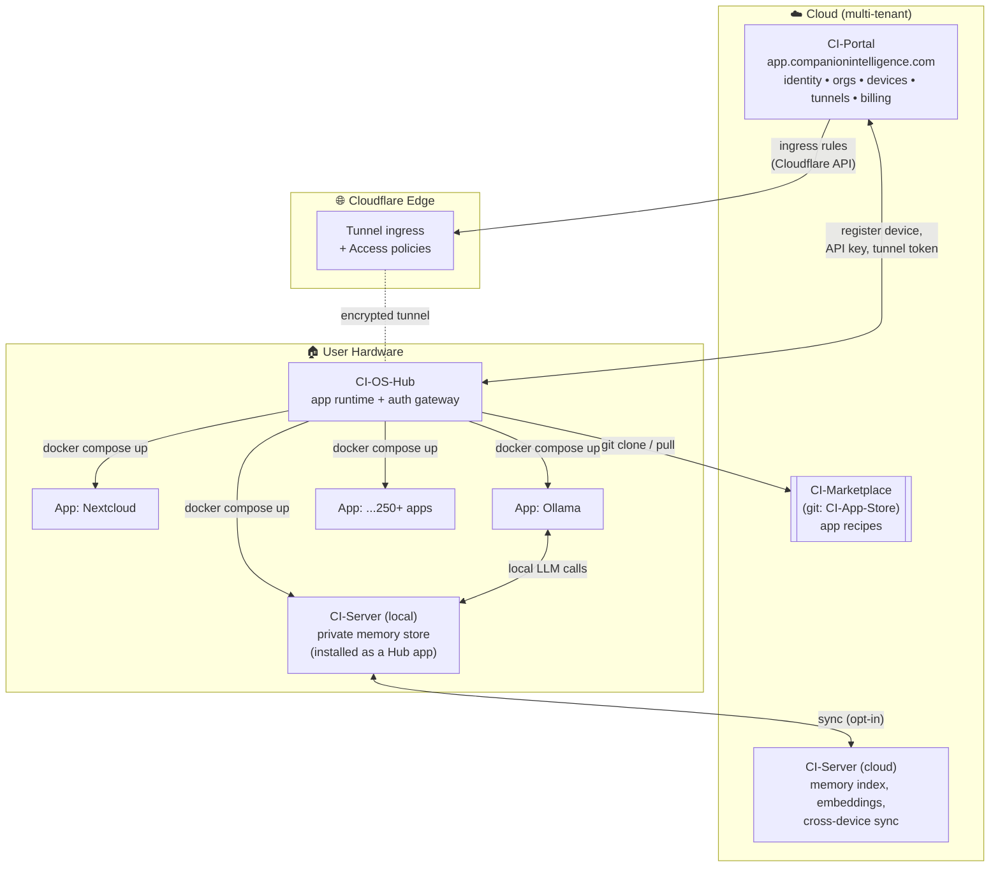
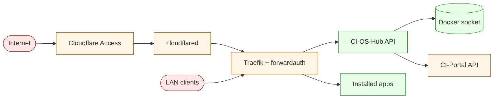

# CI-OS-Hub — Architecture & Roadmap

**Status:** Living document
**Date:** 2026-05-18
**Scope:** System architecture for CI-OS-Hub and its place in the broader Companion Intelligence (CI) platform.

---

## 1. Executive Summary

CI-OS-Hub is the **on-device runtime** of the Companion Intelligence platform — a self-hosted personal homeserver (forked from [Runtipi](https://www.runtipi.io)) that installs, runs, and exposes containerized apps on behalf of a single user or organization. It is one of four cooperating systems:

| System | Role | Runs Where |
|---|---|---|
| **CI-Portal** (`app.companionintelligence.com`) | Cloud control plane — identity, org/device registry, Cloudflare tunnel orchestration, billing. | Cloud (multi-tenant) |
| **CI-Server** (Companion Memory) | Per-org/per-user memory & knowledge layer — long-term context, retrieval, agent state. | Cloud + on-device |
| **CI-Marketplace** (CI-App-Store) | App catalog — git-backed `docker-compose` recipes, metadata, screenshots. | Git repo, mirrored on device |
| **CI-OS-Hub** (this repo) | Local app runtime + tunnel terminator + auth gateway. | On the user's hardware |

CI-OS-Hub is the only component that touches the user's Docker daemon. Portal owns identity and exposure; Marketplace owns the catalog; Server owns memory; Hub owns execution.

---

## 2. CI-Hub Internal Architecture

### 2.1 Stack

| Layer | Technology |
|---|---|
| Frontend | React Router 7 (SPA + HMR), Vite, TanStack Query, generated OpenAPI client |
| Backend | NestJS 11 (Node 22), Express, Server-Sent Events |
| Persistence | PostgreSQL 14 (via Drizzle ORM); JSON config files on disk for app/user state |
| Queue | RabbitMQ 4 (BullMQ-style worker pattern) for app lifecycle commands |
| Container control | `dockerode` → host Docker daemon (`/var/run/docker.sock` bind-mounted RO) |
| Reverse proxy | Traefik v3.6 (auto-discovers app containers via labels) |
| Remote access | Cloudflared tunnel (token-issued by CI-Portal) |
| Monorepo | Bun + Turbo; `packages/{backend,frontend,common}` |

### 2.2 Module Map (backend)

| Domain | Modules |
|---|---|
| Core infra | `configuration`, `database`, `cache`, `filesystem`, `queue`, `sse` |
| Integration | `docker`, `github` |
| Apps | `apps`, `app-lifecycle`, `marketplace`, `app-stores`, `custom-apps`, `env` |
| Identity | `auth`, `user`, `user-config` |
| Ops | `system`, `backups`, `links`, `network`, `i18n`, `debug` |
| Cloud link | `registration`, `cloudflare` |

### 2.3 Container Topology

```mermaid
flowchart LR
  subgraph Host["User Hardware"]
    direction LR
    subgraph net["ci_os_hub_network (bridge)"]
      hub["ci-os-hub<br/>(NestJS + React)"]
      db[("ci-hub-db<br/>Postgres 14")]
      mq[("ci-os-hub-queue<br/>RabbitMQ 4")]
      traefik["traefik:v3.6<br/>:80 :443 :8080"]
      cf["cloudflared<br/>(tunnel run)"]
      apps["installed app<br/>containers"]
    end
    sock(("/var/run/docker.sock"))
    hub -. RO mount .- sock
  end

  user(("User browser<br/>LAN")) -->|http(s)| traefik
  remote(("Remote user<br/>WAN")) -->|HTTPS| cfedge["Cloudflare Edge"]
  cfedge -->|tunnel| cf
  cf --> traefik
  traefik -->|host rule| hub
  traefik -->|host rule| apps
  hub --> db
  hub --> mq
  mq --> hub
  hub -. dockerode .-> sock
  sock -. spawns .-> apps
```

### 2.4 App Install Sequence (happy path)



### 2.5 Data Locations

| Path (host) | Purpose |
|---|---|
| `.internal/state/` | Traefik dynamic config, ACME storage, app state JSON |
| `.internal/repos/` | Cloned app-store git repos (catalog source of truth) |
| `.internal/apps/` | Materialized `docker-compose.yml` per installed app |
| `.internal/app-data/` | Per-app persistent volumes (mounted into app containers) |
| `.internal/user-config/` | Per-org `settings.json` (API key, org ID, overrides) |
| `.internal/backups/` | Tarball backups produced by `BackupsModule` |
| `./tunnel/token` | Cloudflared tunnel token (written by Hub, read by `cloudflared`) |

---

## 3. Place in the Companion Intelligence Platform

### 3.1 System Map



### 3.2 Responsibility Split

| Concern | CI-Portal | CI-Server | CI-Marketplace | CI-OS-Hub |
|---|---|---|---|---|
| User identity & SSO | ✅ owner | consumer | — | consumer (forward-auth via Traefik) |
| Org / device registry | ✅ owner | consumer | — | consumer (registers via callback) |
| App catalog & recipes | — | — | ✅ owner | consumer (clones repo) |
| Persistent memory / RAG | — | ✅ owner | — | hosts (when installed as app) |
| Container lifecycle | — | — | — | ✅ owner |
| Reverse proxy + TLS | — | — | — | ✅ owner (Traefik) |
| Public exposure (DNS / tunnel) | ✅ owner (Cloudflare API) | — | — | terminator (cloudflared) |
| Billing & licensing | ✅ owner | — | — | reports usage |
| Backups | — | optional sync target | — | ✅ owner (local tarballs) |
| Updates | publishes versions | self-updating app | git-pull driven | self-update + app updates |

### 3.3 Cross-System Contracts

| Contract | From → To | Surface | Notes |
|---|---|---|---|
| **Device registration** | Hub → Portal → Hub | `GET /registration/device-id` then OAuth-style callback with `org_id`, `tunnel_token`, `subdomain` | Stored in `settings.json`, not env |
| **Tunnel state** | Hub → Portal | `POST /tunnels/state` with exposed-app map | Portal pushes ingress to Cloudflare |
| **Catalog source** | Hub → Marketplace git | `git clone` / `git pull` configured app-stores | Hub mirrors locally, never writes upstream |
| **App auth** | Browser → Traefik → Hub | `forwardauth` middleware → `/api/auth/traefik` | Single sign-on across all installed apps |
| **Memory access** | Apps → CI-Server (local) | App-defined HTTP/MCP within `ci_os_hub_network` | Server runs as an installed app; same auth surface |
| **Memory sync** | CI-Server local ↔ cloud | Server-owned protocol (opt-in per-org) | Encrypted at rest; out of Hub's scope |

### 3.4 Trust Boundaries



The Docker socket is the highest-privilege resource on the host; only the Hub backend mounts it, read-only where possible. Every external request is gated by Cloudflare Access → forwardauth before it can hit an app.

---

## 4. Architecture Decisions (rationale snapshot)

| Decision | Why |
|---|---|
| Fork Runtipi vs. build from scratch | Mature container lifecycle, Traefik integration, large existing app catalog. Faster to ship Companion-specific features (Portal/Server/auth) than to rebuild homeserver primitives. |
| Postgres (not SQLite) in prod | Concurrent worker + API access; aligns with most installed apps already needing PG. SQLite retained for dev convenience via Drizzle. |
| RabbitMQ for app commands | Decouples slow `docker compose pull/up` from HTTP requests; gives retry + visibility; survives Hub restarts mid-install. |
| Traefik (not nginx) | Native Docker label discovery — installed apps self-register without Hub touching reverse-proxy config files. |
| Cloudflare Tunnel (not port-forward) | No NAT/firewall config required; Portal centrally controls who is exposed and at what hostname. |
| Server as an installed app | Memory is sensitive — running it inside the Hub's app sandbox keeps it under the same auth, backup, and update path as everything else. Avoids special-casing. |
| Marketplace as git, not API | Reviewable (PR-based catalog), forkable for private app stores, no auth needed for read. |
| Bun + Turbo monorepo | Single-runtime install for backend + frontend + scripts; matches the upstream Runtipi direction. |

---

## 5. Development Roadmap

### 5.1 Recent (shipped on `main`)

| Date | Change | Source |
|---|---|---|
| Latest | Local-dev fix for `bun dev` infra/app split | [#92](https://github.com/companionintelligence/CI-OS-Hub/pull/92) |
| Recent | Ollama rsync sync + Squid proxy setup scripts | commit `aa55805c` |
| Recent | Ollama fleet management + LAN sync | commit `b458ead0` |
| Recent | Fleet QA testing docs ([scripts/FLEET_QA.md](scripts/FLEET_QA.md)) | commit `6eba5890` |

### 5.2 Near-term (next 1–2 releases)

| Theme | Item | Notes |
|---|---|---|
| **Memory integration** | First-class Server (`ci-server`) install path | Today: install like any app. Goal: surface as a system primitive in the UI with health + memory-quota in the dashboard. |
| **Fleet ops** | Promote `scripts/qa-*.ts` from shell-driven to a `FleetModule` | Already 7 core + 4 beta servers — needs a control-plane view rather than SSH-fanout. |
| **Local LLM** | Ollama model sync as a managed Hub feature | Scripts exist (`ollama-fleet.sh`, `ollama-lan-sync.sh`). Move into the backend with progress/SSE. |
| **App-store** | Multi-store UX (private + public) | Module exists (`app-stores`); UI to add/remove stores per-org. |
| **Backups** | Off-device backup target (S3/R2 via Portal) | `BackupsModule` currently writes tarballs locally only. |

### 5.3 Mid-term (quarter horizon)

| Theme | Item |
|---|---|
| Multi-device | Promote Portal from "one device per org" to "device fleet per org" — Hub already has a stable device ID, Portal needs the registry shape |
| Auth | Replace forward-auth session cookie with short-lived JWT issued by Portal; enables shared sessions across devices |
| Marketplace | Signed app manifests (cosign) — verify catalog integrity before `docker compose up` |
| Observability | Ship metrics endpoint (Prometheus) + opt-in error reporting (`ALLOW_ERROR_MONITORING` already gated) |
| i18n | Crowdin pipeline is wired ([crowdin.yml](crowdin.yml)); fill out coverage for top-5 languages |

### 5.4 Longer-term (exploratory)

| Theme | Item |
|---|---|
| Agent runtime | Standard MCP gateway inside Hub so any installed app can be exposed as a tool to Server-resident agents |
| K3s mode | Optional Kubernetes backend for `app-lifecycle` (current Docker path stays default) |
| Cross-device app migration | Move an installed app + its `app-data` between two Hubs in the same org |
| Marketplace economy | Paid apps gated by Portal licensing |

### 5.5 Known Risks / Tech Debt

| Risk | Impact | Mitigation direction |
|---|---|---|
| Docker socket bind-mount is broad | Any RCE in Hub = host takeover | Move privileged ops to a thin sidecar; explore rootless Docker / Podman |
| RabbitMQ is heavy for a single-tenant box | Memory floor on small hardware | Evaluate Redis Streams or in-process queue for low-RAM SKUs |
| Postgres bound to fixed port `6543` on host | Conflicts on shared hardware | Keep DB internal-only by default; expose via env opt-in |
| `tunnel/token` lives on disk | Token theft = traffic hijack | Short-lived tokens from Portal; rotate on Hub restart |
| Catalog is `git pull` without verification | Supply-chain risk | Signed manifests (see 5.3) |

---

## 6. Open Questions

1. **Server placement** — Should `ci-server` ever ship *bundled* with the Hub (always-on system service) or always remain a user-installable app? Bundling simplifies onboarding but breaks the "everything is an app" invariant.
2. **Portal authority over apps** — Should Portal be able to remote-install/uninstall apps on a device, or is the Hub always the policy decision point? Affects fleet-management UX vs. user autonomy.
3. **Memory schema ownership** — If Server defines the memory schema, does Hub need any visibility into it for backup/restore, or does Server own its own backup lifecycle entirely?
4. **Marketplace forks** — How do we let users add private stores without re-implementing auth (git over HTTPS with PAT vs. SSH deploy keys)?

---

## 7. References

- Backend module details: [packages/backend/ARCHITECTURE.md](packages/backend/ARCHITECTURE.md)
- Local dev guide: [README.md](README.md)
- Fleet QA: [scripts/FLEET_QA.md](scripts/FLEET_QA.md)
- Upstream: [Runtipi](https://github.com/runtipi/runtipi), [Runtipi App Store](https://github.com/runtipi/runtipi-appstore)
- Sibling repos: `CI-Portal`, `CI-Server`, [`CI-App-Store`](https://github.com/companionintelligence/CI-App-Store), [App Store Launcher](https://github.com/companionintelligence/companionintelligence.github.io)
