# CI-Hub CLI

The preferred packaged executable is:

```bash
cihub <command> [args]
```

## Install

```bash
npm install -g ci-hub
cihub --help
```

One-off without installing:

```bash
npx --package ci-hub cihub --help
```

Homebrew and other package managers expose the same `cihub` executable on `PATH`.

---

## Headless — no graphical session required

Everything the Hub does runs in Docker; only the desktop *UI* needs a display.
On an SSH-only machine, a server, or in CI (including coding agents driving the
box), use one of these instead of launching the GUI:

```bash
companion-hub --detached   # one-shot headless start of the Hub stack, then exits
cihub up                   # same, via the CLI
cihub status               # containers, tunnel, VPN, models
cihub register --code <c>  # pair with Companion Portal (required for marketplace installs)
cihub claim --email <a>    # create the first operator headlessly (after register)
```

Discoverability guarantees:

- The Linux packages (.deb/.rpm) install the bundled CLI at **`/usr/bin/cihub`**,
  executable immediately after `apt install` — no first GUI launch required.
- `companion-hub --help` and `--version` work without a display (they never
  touch GTK).
- Launching `companion-hub` in desktop mode with no `DISPLAY`/`WAYLAND_DISPLAY`
  prints guidance pointing to `--detached` and `cihub` and exits with status 2,
  instead of panicking inside the GTK backend.
- `apt show companion-hub` mentions the headless entry points in the package
  description.

Developer stack override (attach to an externally managed compose stack instead
of the bundled one — skips reconciliation):

```bash
CI_HUB_STACK_DEV=1 \
CI_HUB_STACK_DEV_COMPOSE_PATH=/path/to/docker-compose.yml \
CI_HUB_STACK_DEV_ENV_PATH=/path/to/.env \
companion-hub --detached
```

---

## On-device testing loop

Use this loop when iterating on CLI/TUI or developer workflow changes:

```bash
cihub reset local --yes  # clean local runtime state
cihub up local           # infra + backend/frontend from source
cihub wizard             # run the full interactive flow
pnpm run test:cli        # presentation tests (25 cases)
```

- **`cihub reset local --yes`** — removes local runtime state for clean-slate testing.
- **`cihub up local`** — brings up infra then starts backend/frontend from source; no Docker rebuild needed.
- **`pnpm run test:cli`** — Vitest suite covering banner, step renderer, FTUE detection, arg validation, all wizard selectors, and help/man output.

---

## ASCII banner

Every command entry point shows the Companion Intelligence ASCII banner followed by the company tagline:

<p>
  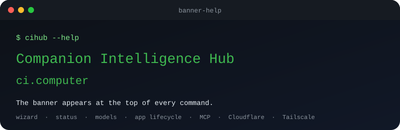
</p>

<p>
  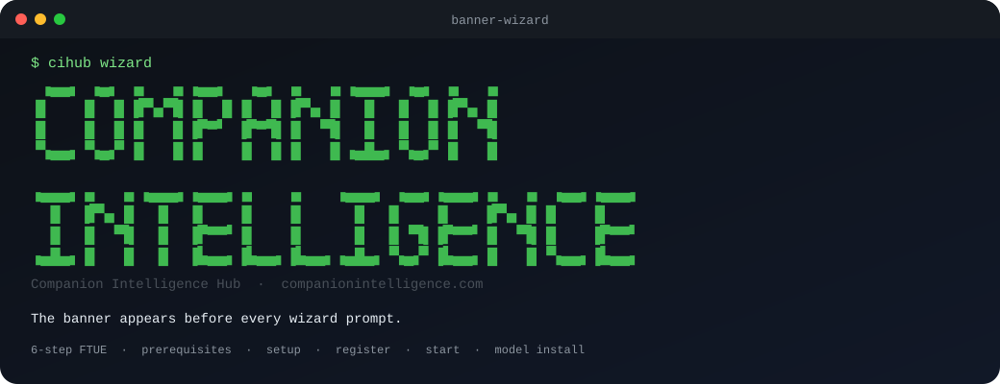
</p>

---

## Help and MAN

```bash
cihub --help     # command reference
cihub man        # manual-style reference with packaging notes
cihub version    # print version from package.json
```

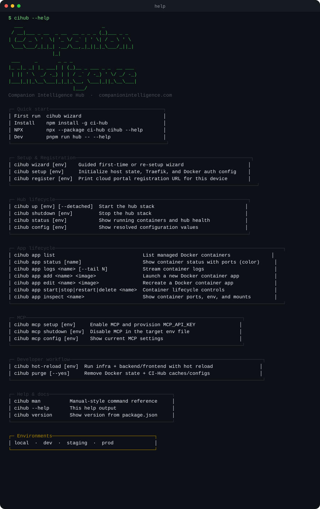

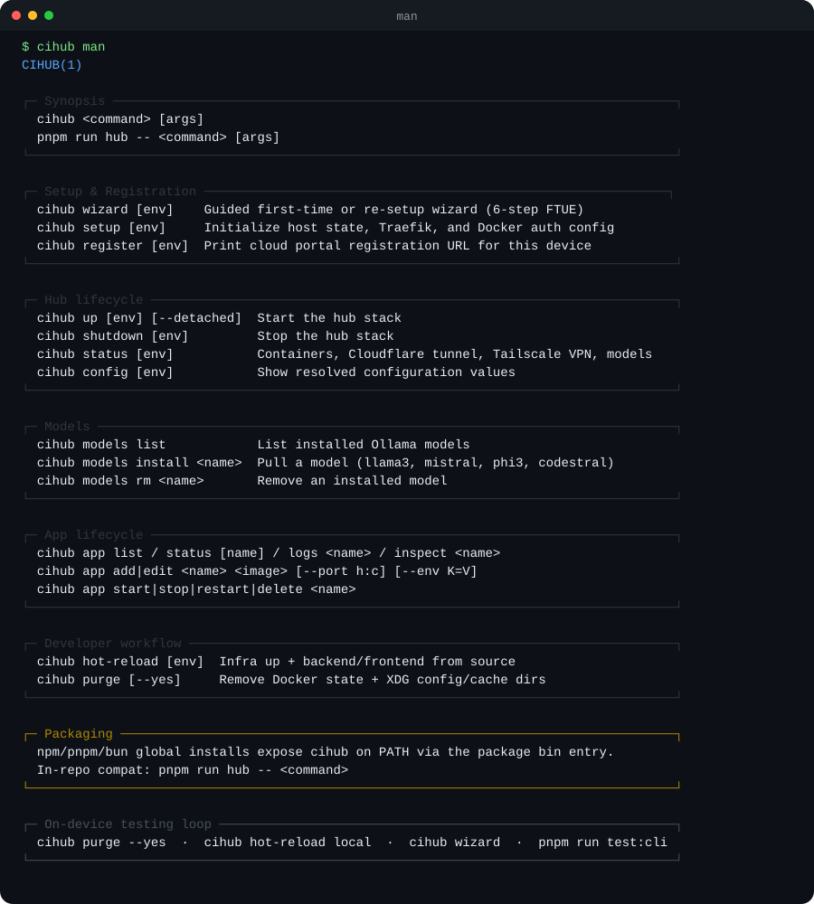

---

## Setup & Registration

### `cihub wizard [env]`

Runs the guided setup wizard. On **first run** (no `env` file found) it enters FTUE mode: shows a step tracker, checks Docker availability, runs setup and registration automatically, then launches the Hub.

```bash
cihub wizard          # local env, first-run auto-detected
cihub wizard staging  # target a specific environment
```

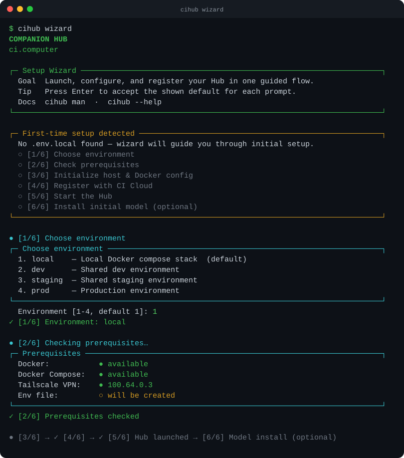

Returning users get the action menu: setup, up, register, config, MCP, down, app-list, reset, restart.

### `cihub setup [env]`

Initializes Traefik and Docker auth config for the target environment.

```bash
cihub setup local
```

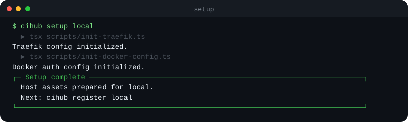

### `cihub register [env]`

Prints your device ID and the Companion Portal registration URL. Open the URL in a browser to pair the device, then proceed to `cihub up`.

Marketplace compose downloads and registry JWTs require the device key Portal issues at pairing ([CI-Portal#634](https://github.com/companionintelligence/CI-Portal/pull/634)). Hub always tries to send it. If this machine is not paired, or cannot store the key, store installs fail and tag lists can look empty — the UI may look slow rather than unauthorized.

**Over SSH, pass `--code`.** The pairing-code prompt needs a terminal and `ssh -n` has none, so with
no terminal and no `--code` the command refuses immediately (exit `2`) naming the flag, rather than
blocking on a stdin that will never answer — which is what it used to do before exiting `0` having
registered nothing. There is deliberately no assume-yes opt-in: assuming yes cannot invent a pairing
code, and only your CI Account can produce one.

```bash
cihub register local
```

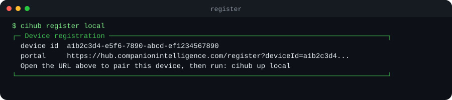

### `cihub claim [env] [--email <addr>]`

Creates this Hub's **first operator**, without a browser. Run it on the Hub, after `cihub register`.

Registration and claiming are two different things, and only one of them was ever headless.
`cihub register` pairs the appliance and writes `ciHubApiKey` and `ciHubOrganizationId` into
`state/settings.json`. It does **not** create a row in the `user` table — that row was written only
by an interactive Portal sign-in landing on `/api/auth/portal/callback`, and `POST /api/auth/register`
cannot finish unattended because Portal answers it with `requiresEmailVerification`.

A Hub in that state is paired, keyed, and unable to authenticate anybody: the device key is accepted,
there is no operator for it to speak as, and every guarded route answers **409
`AUTH_ERROR_HUB_NOT_CLAIMED`** — *"This Hub is registered but has no operator yet"*. It used to answer
`401 SYSTEM_ERROR_YOU_MUST_BE_LOGGED_IN`, which is why twelve of sixteen nodes on the Hub Pool fleet
were diagnosed for a week as having bad device keys. The keys were fine.

What `claim` requires, and why none of it is a new way in:

| Gate | Why it is not a weakening |
|---|---|
| The host-local device key | It lives in `<data-dir>/state/settings.json`; presenting it means you can already read the Hub's credentials off the disk |
| The Hub must be registered | Pairing is what proved organization membership; an unpaired Hub has no organization for an operator to belong to |
| There must be no operator yet | First-operator bootstrap is the one admission that skips the Portal membership check, so it happens at most once |

The row itself is written by `admitHubPerson` — the same function the browser path calls — so there
is exactly one place that decides who may become an operator on this appliance.

**Safe to re-run.** A Hub that already has an operator is reported and the command exits `0`, the
same shape `cihub register` takes when the Hub is already registered, so an installer replaying the
whole flow does not trip on the one step that is done. With no terminal and no `--email` it exits `2`
naming the flag rather than blocking on a stdin that will never answer.

```bash
cihub claim --email you@example.com
```

Afterwards, sign in through CI Portal with the same address for a browser session; anyone else in
the organization is admitted the normal way, membership-checked.


### `cihub login [--scope <scope>]`

Signs this machine in to Companion Portal and stores an organization developer token in
`~/.config/cihub/portal-login.json` (mode `0600`). One browser approval, once — the token is what
later commands present.

```bash
cihub login                            # catalog:write, for cihub submit
cihub login --scope device:pair        # register devices without a browser
cihub login --device                   # device-code flow; automatic over SSH
```

| Scope | What the token may do |
| --- | --- |
| `catalog:write` (default) | Submit apps to the marketplace catalog (`cihub submit`) |
| `device:pair` | Register devices into the organization, which is what mints pairing codes |

**The two do not overlap.** A `catalog:write` token cannot register a device and a `device:pair`
token cannot publish an app; each is refused with `401` by the other's routes. Both are org-scoped
and revocable from Portal, and neither is a device key — pairing is what mints one of those.

A token reaches exactly the organizations its holder is a member of. Portal runs the same membership
check it runs for a browser session, so signing in headlessly removes the human, not the
authorization.

### Registering a fleet without a browser

`cihub register` wants a pairing code, and a code is one device. Minting fourteen of them by hand is
fourteen trips through the Portal UI, which is why `cihub fleet install` mints its own once a
`device:pair` login is stored:

```bash
cihub login --scope device:pair
export CIHUB_POSTGRES_PASSWORD=...
cihub fleet install --nodes core-1,core-2 --user ci --execute
```

Each node is registered under its roster name and gets its own code. Two guardrails are worth
knowing, because both fail in ways a dry run does not show:

- **`--code` with more than one node is refused**, not spent. One code enrolls one device, so using
  it across a fleet would enroll the first machine and fail the rest on a code Portal had already
  burned — halfway through installing on real hardware.
- **A node that cannot be registered is reported and skipped**, not aborted on. A name already taken
  in the org (usually: this node was enrolled before) says so by name, and the rest of the fleet
  continues.

Without a stored `device:pair` login, `--code` still works for a single node exactly as before.

### `cihub status --write-status-file`

Copies this node's status report to the operator's Desktop as `CI_HUB_STATUS.md` — connection
details, the LLM backends running, the models installed, the containerized workloads, and system
status, for auditing a fleet without opening a dashboard per box.

```bash
cihub status --write-status-file
```

**The Hub writes the report; this command only delivers it.** Every service that knows the answers
lives in the backend process, and the CLI holds no credential for the guarded routes that expose
them (`pool/status`, `apps/installed` and `system-inspector` are all behind `AuthGuard`), so
composing it here would mean provisioning an API key on every node just to audit it. The backend
writes `<data-dir>/state/CI_HUB_STATUS.md` every 15 minutes; `fleet install` installs a systemd user
timer that copies it to the Desktop on the same cadence.

Two things the output tells you that the file alone would not:

- **Where it went.** `~/Desktop` is not a given — `xdg-user-dirs` is often unset on a server
  install, the directory is localised, and an appliance brought up with `sudo` has `root` as the
  host user. With no Desktop the file stays in the data dir and the command says so, rather than
  inventing a path.
- **How old it is.** The report carries its own `Generated` timestamp. A stale one means the Hub
  that writes it is not running, so the contents describe when it last ran — not what is running
  now. Past 45 minutes the command says so out loud.

The report distinguishes an unreadable section from an empty one throughout. "No workloads" means
none are installed; a section that could not be read says so and is listed at the top of the file.
It also prints the Hub's own belief about an app beside the live container state, so the case that
matters to an audit — an app the Hub calls `running` with nothing actually up — is visible rather
than averaged away.

---

## Hub lifecycle

```bash
cihub up [env] [--detached]  # start the hub stack
cihub down [env]             # stop the hub stack
cihub restart [env]          # stop then start the target environment
cihub recreate [env]         # reset runtime state, then start again
cihub status [env]           # show container health + resolved config
cihub logs [env] [service]   # stream compose logs
cihub config [env]           # show resolved config values only
```

- `--detached` runs the stack in the background (equivalent to `docker compose up -d`).
- After a reset (no `~/.local/share/companion-hub` seed), `cihub up prod` prompts interactively for a database password and writes a fresh install. Set `POSTGRES_PASSWORD` (or `CIHUB_POSTGRES_PASSWORD`) to skip the prompt.
- `status` shows three sections: **Containers** (color-coded ●/✗), **Network** (local URL, Cloudflare tunnel URL from `CF_DOMAIN`/`DOMAIN`, Tailscale VPN IP), and **Models** (installed Ollama models).

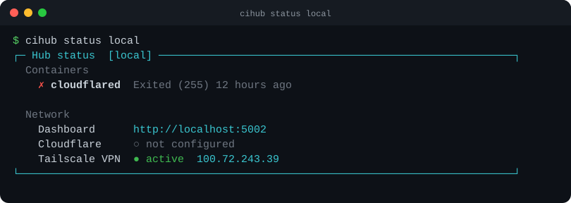

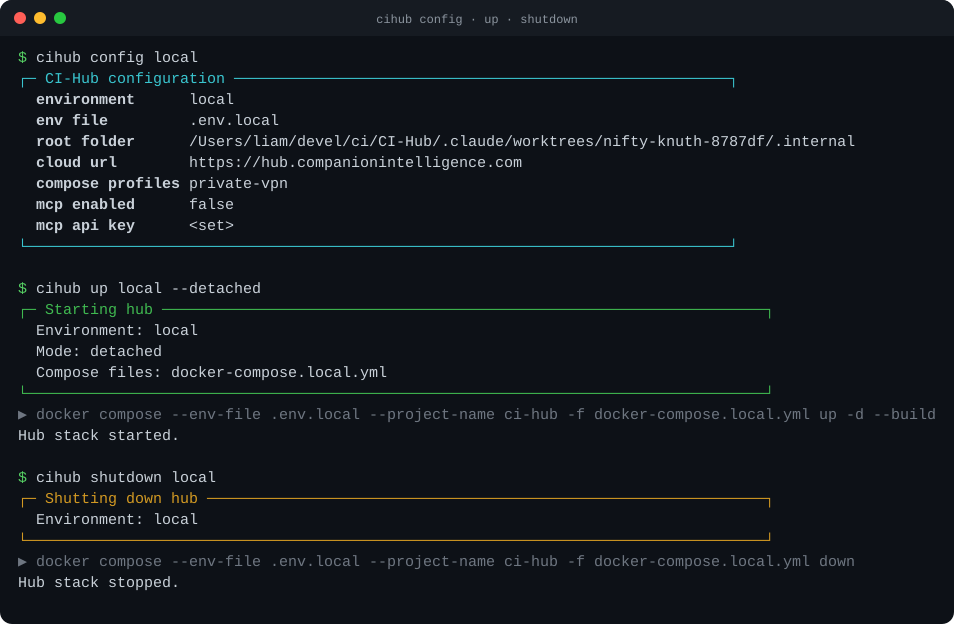

---

## App lifecycle

Manage individual Docker containers on the host machine, independently of the compose stack.

```bash
cihub app list                                        # list all containers
cihub app status [name]                               # color-coded status (all or one)
cihub app logs <name> [--tail N]                      # stream logs (default tail 50)
cihub app inspect <name>                              # ports, env vars, mounts
cihub app add <name> <image> [--port h:c] [--env K=V] # launch new container
cihub app edit <name> <image> [--port h:c] [--env K=V] # recreate (rm -f then run)
cihub app start <name>
cihub app stop <name>
cihub app restart <name>
cihub app delete <name>                               # docker rm -f
```

`app status` shows each container with a color-coded status and the bound ports:

```
demo-ollama    Up 3 hours → 0.0.0.0:11434->11434/tcp
demo-webui     Exited (1) 2 minutes ago
```

`app inspect` parses `docker inspect` JSON and prints a structured summary of image, status, ports, environment variables, and volume mounts.

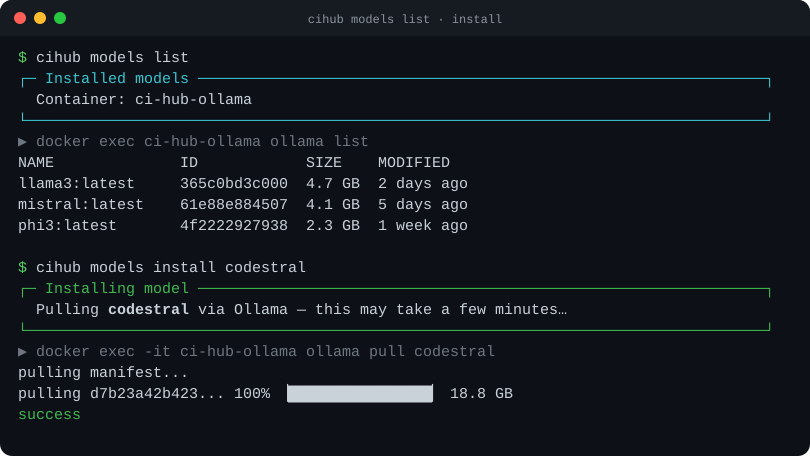

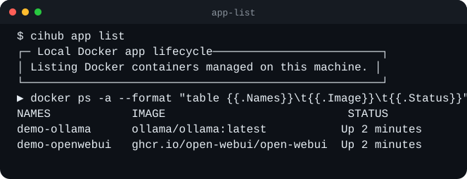

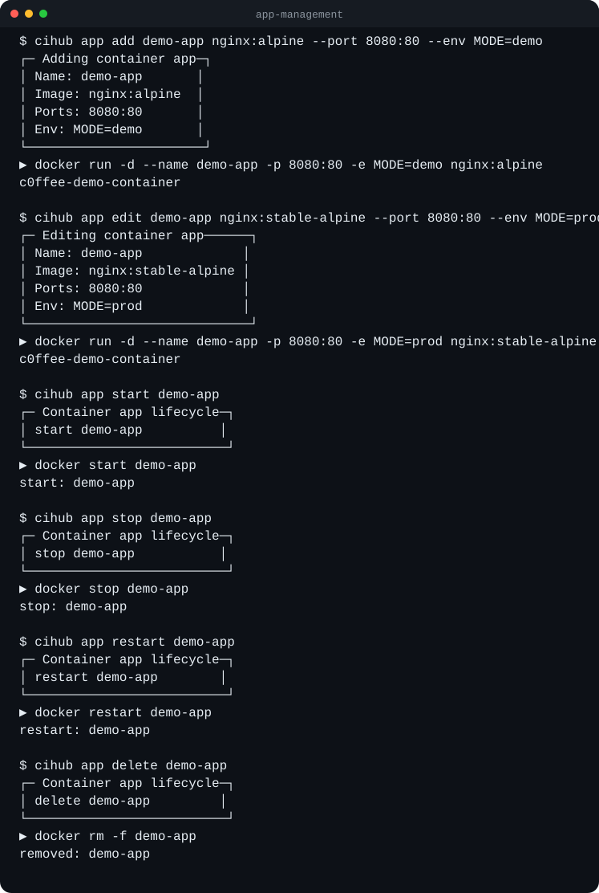

---

## MCP

```bash
cihub mcp setup [env]     # set MCP_ENABLED=true
cihub mcp shutdown [env]  # set MCP_ENABLED=false
cihub mcp config [env]    # show current MCP settings
```

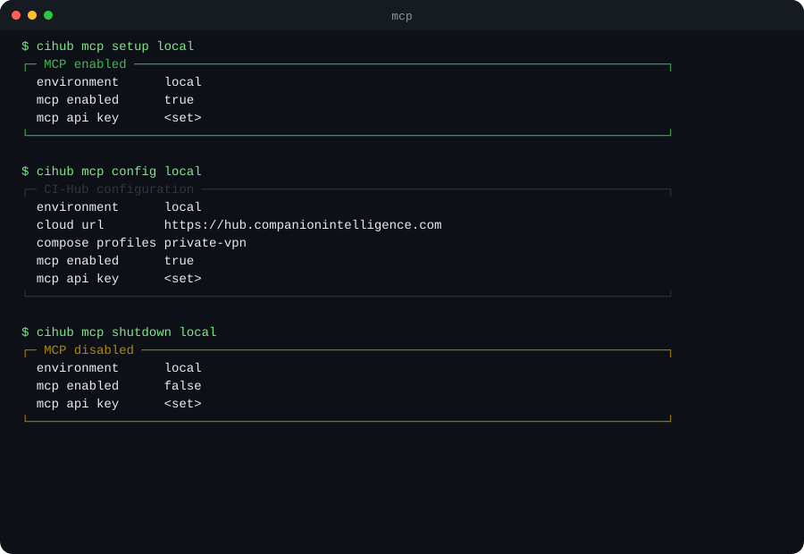

### API keys

The MCP endpoint (`POST /api/mcp`) authenticates with `Authorization: Bearer <key>`, and the key must
carry the `mcp` scope. The hashed key store is the sole authority — `MCP_API_KEY` in the env file is
**not** a credential and nothing is seeded at boot (SEC-MCP-8), so a key must be created explicitly.

```bash
cihub api-key create --name "laptop"   # operator keys carry the 'mcp' scope
cihub api-key list                     # id, name, scopes, capability, prefix
```

The raw key is printed **once** at creation; store it immediately. Revoke keys in
**Settings → Security**.

`create` also accepts `--capability read|write|full`, which decides what the key may do on the
surfaces its scopes opened — `write` is the default. Raise or lower an existing key's capability in
**Settings → Security**; the CLI has `create` and `list` only.

Operator keys carry `mcp` only. The `app` scope belongs to **managed** keys the Hub provisions to
installed apps and revokes on uninstall — the callback guard resolves the key's owning app, so an
operator key carrying `app` would authenticate nothing. Names beginning `app:` are reserved for the
same reason.

Connect an external MCP client with:

```json
{ "mcpServers": { "ci-hub": { "url": "http://<hub-host>:5002/api/mcp", "headers": { "Authorization": "Bearer <key>" } } } }
```

---

## Connect an agent

Wire an agent installed **on this host** to Companion Memory, so it gets passive capture and injected
context rather than memory tools it has to call. This is the memory-provider path, not MCP — the two
are independent.

```bash
cihub connect openclaw --memory-url <url> --memory-key <key>
cihub connect hermes   --memory-url <url> --memory-key <key>
```

| Flag                           | Effect                                                               |
| ------------------------------ | -------------------------------------------------------------------- |
| `--memory-url`, `--memory-key` | Companion Memory base URL and API key. Required; prompted on a TTY   |
| `--hub-url`, `--hub-key`       | Also register the Hub MCP server. Both or neither                    |
| `--force`                      | Claim the memory slot even if another provider holds it (`openclaw`) |
| `--dry-run`                    | Print the plan and write nothing                                     |

**The memory key is not the MCP key above.** The provider talks REST, so the key needs the `Memory`
scope (plus `Intents` for the intent tools) at **Read & write**. A key minted for MCP alone
authenticates and is refused on every capture call, and the plugin swallows failed writes rather than
break a session — which is why the probe checks the key and not just the address.

### What it does

Everything is probed before anything is written, so a failed probe leaves the machine exactly as it
was. Memory is checked twice — `/api/health` for reachability, then `/api/memory/context`, which is
scope-guarded and therefore actually exercises the key. Hub, when its flags are given, is checked
with a real `initialize` + `tools/list` handshake and the tool count is reported.

Both memory legs go out under the User-Agent the agent's own plugin sends, because a probe that
identifies as a different client can only prove something about itself: the hermes plugin talks
urllib, whose default `Python-urllib/x.y` an edge in front of an exposed hub rejects outright. And
because Companion Memory answers in JSON, an HTML error body is reported as a CDN or proxy refusing
the request — not as a bad key, which is the one piece of advice that cannot help there.

For **openclaw** it guards the memory slot first (the guard cannot be delegated: installing by hand
can switch a foreign slot without asking), backs up `openclaw.json`, installs the pinned plugin from
npm, merges the settings the installer does not write — `plugins.slots.memory`, the plugin's `config`
and `hooks.allowConversationAccess`, an additive `tools.alsoAllow`, and disabling the bundled
`session-memory` hook — then validates with `openclaw doctor --lint --json`, restoring the backup if
the lint faults any of the keys it wrote. (It ignores findings about anything else, so a config that
was already untidy is not blamed on this command.) Restart the gateway afterwards with
`openclaw daemon restart` — that manages a service install; a gateway you started by hand has to
be stopped and started yourself. `openclaw daemon status` says which you have.

For **hermes** it stages the pinned plugin tarball into `~/.hermes/plugins/companionintelligence`,
swapping it in only once the download succeeded, and writes the `mcp_servers.hub` block into
`config.yaml` when the Hub flags are given — atomically, `0600`, after a backup, and skipped entirely
if the block is already correct. Memory credentials stay with `hermes memory setup`, which owns them
and runs its own connection test, so you still finish with that command. If a Hub server was
written, start a new Hermes session — `mcp_servers` is read at startup. Not
`hermes gateway restart`: that subcommand manages the messaging gateway and does not reload
`config.yaml`.

It configures **the machine it runs on**. For an agent on another machine, follow the per-agent
instructions in the [connect docs](https://docs.ci.computer/docs/connect) — they need no Hub CLI.

| Exit | Meaning                                                |
| ---- | ------------------------------------------------------ |
| `0`  | connected                                              |
| `1`  | a probe failed — nothing was written                   |
| `2`  | a write failed — the backup was restored, path printed |

One exception to `2`: if the hermes plugin installed but its Hub MCP block could not be written, that
is reported in the summary and the run still succeeds — the plugin is in place and useful without it.

Plugin versions are **pinned in the CLI** and bumped deliberately; `connect` never installs `latest`.

---

## Hub Pool

Operate multi-Hub inference pooling from the terminal — the same surface as **Settings → Network →
Hub Pool**. See [`hub-pool.md`](./hub-pool.md) for how pooling works.

```bash
cihub pool status [env]                       # is pooling routing, and why or why not
cihub pool doctor [env] [--check-latency]     # preflight: can this node be a pool member, and will peers reach it
cihub pool update [env]                       # pull the published image and redeploy — no build toolchain needed
cihub pool peers [env]                        # paired peers: status, last seen, queue depth, models
cihub pool discover [env]                     # unpaired CI-Hub nodes, from every source
cihub pool probe <address> [env]              # is there a CI-Hub at this LAN address?
cihub pool pairing-pin [env]                  # mint the six digits the other Hub will need
cihub pool cancel-pin [env]                   # revoke the outstanding PIN before it expires
cihub pool pair <node> [--name <label>]       # send a pairing request (the other Hub must approve)
cihub pool pair <address> --pin <digits>      # ...or pair by LAN address, no OAuth credential needed
cihub pool approve <id>                       # accept a pending inbound request
cihub pool reject <id>                        # refuse one
cihub pool unpair <id>                        # remove a peer and revoke both tokens
cihub pool pin <node|local> [--model <id>]    # prefer one node for a model, or for everything
cihub pool unpin [--model <id>]               # drop that preference and rank by load again
cihub pool log [env] [--limit N]              # recent routing decisions, failovers marked
cihub pool enable [env] | cihub pool disable  # flip the persisted kill switch
cihub pool enable --outbound | --inbound      # ...or just one direction
cihub pool peer-enable <id> | peer-disable    # take one peer in or out of the pool
```

| Flag | Effect |
| ---- | ------ |
| `--yes` | Skip the confirmation prompt. Required for `pair`/`approve`/`reject`/`unpair`/`enable`/`disable` on a non-interactive terminal |
| `--name <label>` | `pair` only: a display label for the peer |
| `--model <id>` | `pin`/`unpin` only: which model the pin covers. Omit it for the pool-wide pin. Compared verbatim against the engine's inventory, so case matters |
| `--pin <digits>` | `pair` only: the six digits minted on the *other* Hub. Required when the target is an address |
| `--limit N` | `log` only: how many decisions to show, 1–200 (default: all 200 retained) |
| `--check-latency` | `doctor` only: also measure non-streaming first-byte latency. Spends GPU time, so it is skipped otherwise |

**It runs on the Hub it manages.** Every call goes to `http://127.0.0.1:<API_PORT>` — `cihub pool` on
machine A cannot manage machine B, which matters more than usual for a feature about several Hubs.
Approving a pairing request means running `cihub pool approve` (or clicking Approve) **on the Hub that
received it**.

**It needs the Portal device key**, the same credential the dashboard uses, read from
`state/settings.json`. A Hub that has never run `cihub register` has none, and the command says so
instead of returning a bare 401. A key from `cihub api-key create` is MCP-scoped and is *not* accepted
here.

### `cihub pool status`

The whole operator picture for one node, and the only place pins, the outstanding PIN, and peer
authentication modes are listed — there is no `pool pins` subcommand to keep in step with it.

| Block | What it answers |
| --- | --- |
| `Pooling` / `Outbound` / `Inbound` | Whether work moves, in each direction, and which switch is responsible |
| `Peers` / `Discovery` / `Settings` | Counts, whether the Tailscale Admin API credential is set, and the persisted settings |
| `This node` | Name, tailnet, hardware tier, live queue depth, engines, and this node's pool **identity fingerprint** |
| `Pairing` | Only when a PIN is outstanding: until when, and how to revoke it. Never the digits |
| `Pins` | Each pin with its target resolved, and whether it can apply right now |
| `Peers` table | Per peer: id prefix, name, direction, status (with strikes and `/off`), last seen, queue, engines |
| `Peer auth` | Which peers are still on the legacy bearer token — the precondition for `poolRequireSignedPeers` |

The `Peer auth` block exists because turning on `poolRequireSignedPeers` while any peer is still on a
bearer token takes **both** directions of that pairing down. The upgrade runs on a health poll by
itself, so the block names the peers not there yet, and says plainly when the switch has become safe
to set. Peers that have not finished pairing are not counted either way.

### Identifying a peer

`approve`, `reject` and `unpair` take the 8-character `ID` from the peers table, the full row uuid, or
the peer's FQDN. An ambiguous prefix is refused rather than guessed.

`pair` takes either the MagicDNS name a peer publishes on the tailnet
(`hub-b.example-tailnet.ts.net`), or a LAN address with `--pin`. Anything that is not a plausible
MagicDNS name is read as an address, and an address without a PIN is refused with the reason: an
address can reach the other Hub but cannot *name* it, and a peer is stored under its tailnet name.

### `cihub pool discover`

Lists every unpaired candidate this Hub can *name*, from up to three directories: the local Tailscale
daemon's peer map, the Tailscale Admin API when a credential is configured, and the CI Portal device
registry on a registered Hub. A node two of them both name is listed once.

**In practice only the two Tailscale directories return anything.** The Portal leg is refused (it
presents a device key to a route that wants a browser session) and would name nothing anyway (Portal
stores no MagicDNS field), and it fails silently — so an empty list is not evidence your Hub is
unregistered. See
[`hub-pool.md` → Where pairing candidates come from](hub-pool.md#where-pairing-candidates-come-from). A Hub found with
`cihub pool probe` is **not** here and never will be: entries are paired with by handing their name
to `pool pair`, and an address has no name until the PIN exchange produces one.

A Tailscale OAuth client (`TAILSCALE_OAUTH_CLIENT_ID` / `TAILSCALE_OAUTH_CLIENT_SECRET`,
`devices:core:read`) enumerates the whole tailnet at once and is worth having when a pool spans
several networks. It is **optional**, and it is the only one of the three that needs a credential:
a tailnet-connected Hub already lists the peers its own daemon can see. Without the OAuth client, the
empty-list output points at `cihub pool probe` first and names the variables second.

The `Discovery` line in `cihub pool status` reports **only** the Tailscale credential, because that is
the only candidate directory `GET status` reports on — the daemon peer map and the Portal registry are
not in that response (the `Tailscale` line below it is the daemon leg's precondition, not its result).
It is not a report on whether discovery works.

A Hub your CI account knows only by LAN address is not listed: a peer is stored under its tailnet
name, and an IP literal can never be one. Pair with it by address instead. See
[`hub-pool.md` → Where pairing candidates come from](hub-pool.md#where-pairing-candidates-come-from).

### `cihub pool probe` and pairing by address

```
cihub pool probe 192.168.1.42
cihub pool probe 192.168.1.42:5010     # a Hub that moved its published API port
cihub pool probe mini-pc.lan
```

Asks whether a CI-Hub is at that address and which pool protocol it speaks. It does **not** report a
name, and the output says so: `GET /api/inference/pool/identify` is unauthenticated and reachable
through the public tunnel, so it discloses no MagicDNS name to anybody.

The name comes from pairing, gated on a PIN:

```
on the other Hub:  cihub pool pairing-pin              # six digits, ten minutes, single-use
here:              cihub pool pair 192.168.1.42 --pin 123456
```

The PIN authenticates the request; the reply carries that Hub's tailnet name (and its node UUID and
public key, so the pairing starts out signed rather than on a bearer token). The peer is stored under
that name, and every pooled request goes to `https://<name>` with the same TLS and the same
credentials. The address was only ever a way to reach the handshake.

Refused: any address that is not RFC1918, CGNAT or IPv6 ULA; a hostname where *any* resolved address
is public; loopback and link-local. With no explicit port it tries 5002 then 3000, and cannot infer a
published port that was moved — name it if so. A Hub running an older pool protocol is reported as
found-but-not-pairable-by-address, because it cannot answer a PIN with its name; pair with it by
MagicDNS name instead.

### `cihub pool pairing-pin`

Mints the six digits that let another Hub pair with **this** one by address, and prints the
`cihub pool pair` line to run on that other machine.

```
cihub pool pairing-pin   # mint: six digits, ten minutes, single use
cihub pool cancel-pin    # revoke the outstanding PIN now
```

**It runs on the Hub that will receive the request** — the opposite side from every other pool
command, and the one thing that is easy to get backwards. Mint here, type there.

The digits are returned **once**, by this command. `cihub pool status` reports only that a PIN is
outstanding and when it expires, so an operator who loses the digits mints a new one — and minting
*replaces* the outstanding PIN rather than adding a second, which invalidates any digits still on
screen elsewhere. A PIN also dies on its fifth wrong guess.

The output includes this node's **key fingerprint**, because minting is the moment both machines are
usually in front of the same person: the far Hub pins that key during the handshake and gets no
second chance to check it. A Hub whose identity failed to bootstrap says so here instead, and pairs
on a bearer token.

Minting a PIN is **not** pre-approval. The inbound request still lands as `pending` and still needs
`cihub pool approve <id>` on this Hub.

Headless appliances need this command: pairing by address is the path that requires no Tailscale
OAuth credential, and a machine with no dashboard has no other way to mint a PIN.

### `cihub pool doctor`

A preflight for the failures that are **silent**: the ones where the node keeps reporting itself healthy
to its own operator while peers quietly stop using it. Every check traces to a failure a real fleet
rollout hit. Read-only — it never pairs, unpairs, writes a setting, restarts anything, or moves a git ref
— and it degrades rather than aborting, so it still produces a full report on a machine with no Docker, no
Tailscale and no Hub. That machine is the one being set up.

| Check | Question | The silent failure it catches |
| ----- | -------- | ----------------------------- |
| **A1** | Does the env file define `API_PORT` and `ROOT_FOLDER_HOST`? | A stub env file. Nothing downstream can recover them, and there is no non-interactive way to write one — so the fix printed is the literal lines to append |
| **A2** | Does the Hub answer `GET /api/health`? | Told apart from "the port is held by something else", which needs a different fix |
| **A3** | Does this **build** have Hub Pool, and which protocol? | Three outcomes, three meanings: `404` predates Hub Pool; `200` with no `poolProtocol` is protocol 1 and will not pair by address with a v2 node; `200` + `poolProtocol` reports the number |
| **A4** | Can the container user write the data dirs? | Docker creates missing bind-mount sources as `root:root`; the Hub then dies `EACCES` on `/data/state/settings.json` with an unhealthy container and no operator-facing reason. Checked by `stat`, so it works with no Docker. A directory that could not be read is reported as unread, never as absent — and the recursive `chown` is withheld for a tree this run never saw |
| **B1** | Does this checkout match the image the container runs? | A node sat on a July checkout while its container ran a build from dev tip, so its `cihub` answered `✗ Unknown command: pool` while its own Hub served the pool routes all day. Decided from the image's `org.opencontainers.image.revision` label where there is one; with no label it says only what two build dates can prove, and otherwise reports that it cannot correlate them — never a version comparison inferred from an ordering |
| **B2** | Can this node even tell that it is behind? | A node that cannot `git fetch` has a **frozen** `origin/dev`, so `git rev-list --count HEAD..origin/dev` answers 0 forever. Measured on a fleet node: auth failed, the count read 0, HEAD was two months old. Asks the remote with `ls-remote` — read-only, and deliberately not a fetch, which would repair the condition being looked at — and reports behind as *unknown*, never as 0. Both sides of the difference are counted, so a checkout carrying local commits is called diverged and is not handed a `pull --ff-only` that git will refuse |
| **B3** | Does the running container match what its compose declares? | A node took a new image under an appliance compose written months earlier and so was missing the host Tailscale socket and CLI that #1279 added: `/identify` returned `nodeFqdn: null`, pairing could never complete, and nothing reported the mismatch. Compared against the file the container was **created from**, found from its own `com.docker.compose.project.config_files` label — an appliance keeps its compose outside the repo — and each missing mount and backend URL var is named |
| **B4** | Does the Hub this CLI drives serve every pool route this CLI calls? | GET pool routes are probed for existence (a `401` proves a route is there; only a `404` says it is not). One direction, because only one is observable: a CLI old enough to lag its Hub answers `✗ Unknown command: pool` and never reaches this check at all, so that skew is B1's to measure, not this one's |
| **C1** | Is the tailnet up, and does this node have a MagicDNS name? | Peer callbacks are `https://<nodeFqdn>` with **no** fallback, so an unnamed node is unreachable however healthy it is |
| **C2** | Is `tailscale serve` publishing this Hub? | `serve` needs an operator grant. Without it the Hub logs one line at boot and behaves normally forever while no peer can reach it. Decided from `tailscale serve status --json`, and it takes a handler at `/` on the `:443` listener proxying to this Hub's port — exactly the path a peer callback takes, so a `/hub` mount, another listener or a raw TCP forward is not accepted as publishing. A node cannot reach its own serve listener, so a self-probe that succeeds is used and one that fails decides nothing; the first HTTPS request after enabling serve blocks ~30s on cert issuance and is retried before it is reported |
| **D1** | Does a **cold** capabilities build fit the 8 s peer probe budget? | Measured at 10.02 s on a real node: every peer probe timed out, the node went `unreachable` fleet-wide, nothing routed to it — and it reported `healthy` throughout. Prints a per-backend breakdown so the slow one is named |
| **D2** | Do the backend URLs resolve, and resolve fast? | An unresolvable compose service name fails **instantly under curl** but blocks ~5 s in `getaddrinfo`, which is what the Hub actually uses. Two of those is the whole D1 budget. Probed with `dns.lookup` from inside the Hub container where one is running — the only vantage that tells a compose-internal name from a broken one. The URLs themselves are read from the container's environment, which is where compose sets them — with no container to read, an empty list is reported as *could not determine*, never as a pass |
| **D3** | Non-streaming first-byte latency vs the 15 s peer connect timeout | A warm 27B model could not return **headers** in 15 s non-streaming while the identical streaming request answered in ~1 s. Measured against a model an engine is actually holding (`loaded`/`pinned`, text modality) — a model on disk would time its cold load, and an embedding model would answer 400 — and asks for a few hundred tokens, because the defect is buffering the whole completion and one token has nothing to buffer. Opt-in behind `--check-latency`; otherwise reported as skipped with the reason |
| **E1** | Can the Hub container reach the host's inference backends? | The existing bridge section, reused unchanged: `ufw` silently blocked container→host Ollama on a node with 8 models and the Hub reported an empty inventory with no error |

Section **B** is written to one rule: an unprovable claim is not made. Where the evidence supports only
"the repo has commits the image cannot contain", that is what it prints; where it supports nothing, it says
it cannot correlate the two and stops. A node that cannot read its upstream reports how far behind it is as
*unknown* — repeating the frozen number is the bug, not the report.

D1 is measured **cold** by construction: `getOwnInventory`'s 20 s TTL is below the ~30 s peer poll, so
every real probe rebuilds the inventory too, and the routes the doctor times call straight through to the
inference router with no cache in front. Both concurrent fan-outs are timed together, because that is what
`Promise.all([getStatus(), listModels()])` actually costs.

A verdict is one of five, and each has its own glyph: `✓` passed, `!` warned, `✗` failed, `?` could not
be determined, `-` was skipped. Colour is never the difference, because it is stripped the moment the
report is piped, redirected or pasted into a bug — which is how a fleet report travels. **Only decided
failures count as issues** — "I could not look" and "I looked and it is broken" never share an encoding,
or an unequipped machine reports a fleet-wide outage.

A fault inside one section collapses that section alone: the others are still collected and printed, and
the run counts an issue for the section it lost, so a half-collected report can never come out all-clear.
Sections are announced as they land once a run passes three seconds, so a slow node shows progress rather
than a frozen terminal.

No secret is ever printed. The operator key is read from `<ROOT_FOLDER_HOST>/state/settings.json` to reach
the authenticated routes behind the per-backend breakdown; it is never echoed, and neither is a PIN, a peer
token, or any `TAILSCALE_OAUTH_*` value.

### `cihub pool update`

Pull `ghcr.io/companionintelligence/ci-hub:<env>` and redeploy. Unlike `cihub up`/`cihub setup`, this
never passes `--build` — it exists for the fleet node that has no GitHub Packages token and therefore
cannot build the image at all, which used to mean shipping a `docker save | docker load` by hand,
per node, every update.

It touches a git checkout only when doing so is certain to be lossless: a clean tree already on `dev`
gets fast-forwarded (`git fetch` + `git merge --ff-only`); anything else — uncommitted changes, a
different branch, no checkout at all — is left untouched and reported, never reset or stashed on your
behalf. After the pull and redeploy it polls `/api/health` for up to ~20s, then reads `poolProtocol`
off `/api/inference/pool/identify` so you know at a glance whether the redeploy landed and whether this
build has Hub Pool at all.

Runs before the device-key gate, like `doctor` — the node most likely to need it has no key yet either.

### `cihub pool log`

The answer to "is pooling actually doing anything". One line per routing decision — time, direction,
model, the node that served it, which ranked candidate won, time to response headers, and outcome — with
a `↳ failed over from …` line naming the chain whenever a candidate was tried and rejected. `in` rows are
work a *peer* sent to this node's engines.

The log is in-memory, process-local and holds the last 200 decisions, so an empty log means "nothing
routed since this Hub started", not "nothing ever routed". Duration is time to headers, not the streamed
generation.

### `cihub pool enable` / `disable`

With no flag these write the persisted **master** `poolEnabled` setting through the Hub API; they take
effect on the next request, with no restart. **`HUB_POOL_USER_DISABLED=true` in the env file wins.** Under
that override, `enable` saves the setting and then says plainly that nothing changed in effect, naming the
file to edit and the restart needed — it never reports success it did not deliver.

Disabling keeps existing pairings. Peers mark this node unreachable while it is off and pick it back up
on their next successful health poll.

`--outbound` and `--inbound` write one half instead, each with its own env override
(`HUB_POOL_OUTBOUND_DISABLED`, `HUB_POOL_INBOUND_DISABLED`) and the same refusal to claim a success it did
not deliver. Pass at most one; passing neither is what "the master switch" means.

- `disable --outbound` stops this Hub sending work to peers. Peers may still send work here, and a request
  this node cannot serve now fails locally with the usual 502 instead of being shipped out.
- `disable --inbound` stops this Hub serving peers' work while it keeps using them. Peers see a healthy
  node advertising an empty inventory — **not** an unreachable one — and route elsewhere.

`cihub pool status` prints both directions with the switch actually responsible for each.

### `cihub pool peer-enable` / `peer-disable`

Take one peer in or out of the pool. Symmetric: no work moves in either direction with a disabled peer.
The pairing, both directional tokens and the health poll are kept, so re-enabling is instant and needs no
approval from the other side — and disabled peers keep being polled, so the status card stays honest about
a machine that is up. It is therefore **not** a revocation; `cihub pool unpair` is. Disabled peers print as
`connected/off` in the peer table.

---

## Fleet

Every other command in this CLI acts on the machine it runs on. `cihub fleet` is the one group that
acts on **other** machines, over SSH — which is the first thing to know about it, and the reason the
read-only subcommands are the default and the rest need `--execute`.

```bash
cihub fleet scan [--lan] [--write-roster] [--json]     # find machines, and what each one will allow
cihub fleet list [--json]                              # the saved roster, and what a run would skip
cihub fleet status [--nodes a,b] [--json]              # re-probe every rostered node
cihub fleet preflight [--nodes a,b] [--touches-boot]   # is each node safe to hand a package transaction?
cihub fleet backends [--backends a,b] [--execute]      # what each node can run for inference, then install it
cihub fleet backends [--backends a,b] [--bind tailnet|all|local] [--execute]  # what each node can run for inference, then install it
cihub fleet install [--user <acct>] [--execute]        # stand a Hub up on each node and register it
cihub fleet update [--hub] [--models a,b] [--execute]  # refresh the Hub image, pull models
cihub fleet apps [--apps a,b] [--endpoint pool|local]  # can each node serve an agent its credentials
cihub fleet cert [--nodes a,b] [--execute]             # the tailscale TLS cert each node needs to pool
```

**`scan`, `list` and `status` change nothing, anywhere; `apps` reads and installs nothing.**
`backends`, `install`, `update` and `cert` require `--execute`; without it they print the plan they
would run, touch nothing, and exit `0`. A tool that can reach fourteen machines should make the destructive
cihub fleet boot-params [--i-have-console] [--execute] # gfx1151 GTT kernel params: live vs staged, and the GRUB edit
```

**`scan`, `list` and `status` change nothing, anywhere; `apps` reads and installs nothing.**
`backends`, `install`, `update` and `boot-params` require `--execute`; without it they print the plan
they would run, touch nothing, and exit `0`. A tool that can reach fourteen machines should make the destructive
**`scan`, `list`, `status` and `preflight` change nothing, anywhere; `apps` reads and installs nothing.**
`backends`, `install` and `update` require `--execute`; without it they print the plan they would
run, touch nothing, and exit `0`. A tool that can reach fourteen machines should make the destructive
path the one you have to ask for.

**Authentication is the tailnet, not a key you manage.** There is no `-i`, no agent forwarding and
no password path. Every remote call runs `BatchMode=yes`, so a node that would prompt fails fast
instead of hanging a fourteen-machine sweep on a TTY nobody is watching, and access stays an ACL
decision you can read and audit.

These commands take no `[env]` argument — they act on remote machines, not on one of this machine's
environments. `cihub fleet scan prod` is an argument error, not a retarget.

### `--user`, and why you usually need it

The tailnet grants SSH to *specific accounts*, and rarely the one you are logged in as locally: this
fleet grants `root` where the QA harness assumes `ci`. There is deliberately no baked-in default —
guessing would be wrong half the time and silently. Pass `--user <account>`, or set `FLEET_SSH_USER`;
a roster entry may also carry its own `user`, which wins for that node.

`scan` tells the two SSH refusals apart, because they need opposite responses:

- **`acl-wrong-user`** — the node is administrable and you named the wrong account. Re-run with
  `--user`. The scan says so by name and prints the flag.
- **`acl-denied`** — the ACL grants you no SSH here at all, and no flag fixes it. That node can serve
  inference perfectly while being unadministrable, which is exactly the state two machines on this
  fleet sat in unnoticed for an unknown period.

That is also why the scan reports **SSH**, **HUB** and **ENGINES** as three separate columns. They
are independent questions, and every fleet tool that collapsed them into one "online" column has
been wrong in the same direction.

### The roster

`<data-dir>/fleet.json` — on Linux `~/.local/share/companion-hub/fleet.json`, on macOS
`~/Library/Application Support/companion-hub/`, on Windows `%APPDATA%\companion-hub\`, or wherever
`CI_HUB_DATA_DIR` points. It sits beside the Hub's other state rather than in a checkout, because
`cihub` is installed on appliances that have no repo.

**Only `cihub fleet scan --write-roster` writes it**, and every other subcommand reads it and acts on
nothing else. A machine that has never been scanned into the roster is invisible to `status`,
`backends`, `install`, `update` and `apps`.

Two properties of the file are load-bearing:

- **`ip` is the identity; `name` is only a label.** Every merge and lookup keys on the address,
  because the rosters this replaces gave one machine five different names across two files and had a
  row whose name and address disagreed outright. `--nodes` matches either, since an operator types
  whichever they remember.
- **A node can be excluded, and say why.** `"skip"` takes `llm-only` (serves inference, grants no
  SSH), `unreachable` (known down, awaiting hands-on recovery) or `excluded` (deliberately out of
  scope). Skipped nodes are printed with the reason instead of being re-attempted at a timeout each
  and landing in the report looking like a machine that broke this morning. A re-scan never clears a
  `skip`, a `note` or a name you chose — discovery fills fields that are absent and corrects
  `tailnetName`, which is a fact about the network rather than a preference.

A malformed row costs that row and names it, not the whole file: running against nineteen nodes
while believing it was twenty is the worse failure.

### Flags

| Flag | Effect |
| ---- | ------ |
| `--execute` | `backends`/`install`/`update`/`boot-params` only: actually apply. Without it, the plan is printed and nothing changes |
| `--nodes a,b` | Restrict the run to these roster entries, by name **or** address |
| `--user <account>` | Remote account to SSH as. `FLEET_SSH_USER` sets the same thing; a roster entry's own `user` wins |
| `--json` | Machine-readable report — `scan`, `list`, `status`, `backends`, `install`, `apps`. `update` has none |
| `--lan` | `scan` only: also sweep the local subnet. Off by default, because touching every address on the operator's subnet is a more intrusive act than listing a tailnet they already belong to |
| `--no-tailnet` | `scan` only: skip tailnet enumeration |
| `--write-roster` | `scan` only: save the result to `fleet.json` |
| `--timeout <ms>` | Per-probe budget, 250–120000 (default 4000) |
| `--concurrency <n>` | Parallel **probes**, 1–32 (default 4). The runners stay serialised regardless |
| `--force` | `install`/`update` only: proceed on a node whose preflight said `block`. The finding is still printed, marked as overridden |
| `--touches-boot` | `preflight`/`install`/`update`: rate the boot-recovery and grub-customizer findings as `block` rather than `warn`, as they are before anything that touches the kernel, initramfs or GRUB |
| `--backends a,b` | `backends` only: from `ollama`, `vllm`, `lucebox`, `dspark`, `mtplx`, `lemonade`. Omit for all six |
| `--bind tailnet\|all\|local` | `backends` only: where Ollama listens (default `tailnet`, the node's Tailscale IPv4 from `tailscale ip -4`). Written to one drop-in and read back after the restart — see [Ollama's bind](#ollamas-bind-one-file-read-back) |
| `--data-dir <path>` | Where the Hub keeps runner venvs and model dirs on the **remote** machine (default `/var/lib/companion-hub`) |
| `--code <code>` | `install` only: one Portal pairing code, which enrolls exactly one node |
| `--claim-email <addr>` | `install` only: create each Hub's first operator for this CI Account address (`CIHUB_CLAIM_EMAIL`). Omitted, the claim step is **skipped and reported as skipped** — never guessed |
| `--join-pool <node>` | `install` only: pair each installed node into that Hub's pool |
| `--pool-pin <digits>` | `install` only: the PIN minted on the Hub being joined, for pairing by address |
| `--hub` | `update` only: update the Hub image |
| `--models a,b` | `update` only: pull these models on each node |
| `--apps a,b` | `apps` only: from `hermes-agent`, `openclaw`. Omit for both |
| `--endpoint pool\|local` | `apps` only: which endpoint the report is labelled for (default `pool`). The check itself is the same either way — see below |
| `--i-have-console` | `boot-params` only: lift the refusal on a node with a hidden zero-timeout GRUB menu and no `console` in its roster entry. You are asserting you can reach that machine's console if the next boot fails |

The Postgres password `install` needs is read from **`CIHUB_POSTGRES_PASSWORD`** and has no flag, so
it never lands in a shell history or a process listing.

### `cihub fleet scan`

Enumerates the tailnet (add `--lan` for the local subnet), probes each candidate on the three axes
above, and prints a verdict per node. It writes nothing unless `--write-roster` is passed, and says
so at the end rather than leaving you to wonder. With no Tailscale CLI it says that too, and
enumerates nothing — set `TAILSCALE_CLI` if yours is somewhere unusual.

### `cihub fleet list` and `cihub fleet status`

`list` prints the roster as saved, plus the nodes a run would skip and why. `status` re-probes them:
administrable, running a Hub, serving engines, and — for every node it can SSH to — whether the
tailscale TLS certificate pooling depends on is in the node's store. Neither touches a node beyond
the probe.

The **TLS CERT** column never goes blank. `ok, 62d left` is a certificate seen with privilege;
`absent` is a store listed with privilege that lacks the file; everything else is `—` followed by
what stopped the measurement: `unreadable without sudo`, `HTTPS not enabled on tailnet`, `no
tailscale`, `ssh failed (acl-denied)`. The distinction is not cosmetic. tailscaled's store at
`/var/lib/tailscale/certs` is `drwx------ root`, so an unprivileged `ls` prints nothing, and the
first probe of this fleet reported zero certificates on eighteen nodes that had fourteen. Pass
`--user root` (or an account with passwordless sudo) to measure it.
administrable, running a Hub, serving engines, and — for every node it can SSH to — where Ollama
binds and **which drop-in decided it** (`100.64.0.9:11434 ← zzzzz-cihub-bind.conf`), with a
`CONFLICT` flag when more than one file sets `OLLAMA_HOST` and the winner is not the canonical one.
Neither touches a node beyond the probe.

### `cihub fleet preflight`

Per node, in one SSH round trip: `sudo -n true`, `dpkg --audit`, `apt-get check`, a listing of
`/etc/grub.d`, `/etc/default/grub`, `/sys/class/ipmi`, and the package lock table. Reads only — there
is no `--execute` because there is nothing to execute. `install` and `update` run the same five checks
on each node before touching it; this is the standalone view, for looking before a pass rather than
being refused partway through one. Exits `1` if any node would be refused, so `cihub fleet preflight
&& cihub fleet install --execute` is a gate.

| Check | Reads | Finding |
|---|---|---|
| `sudo` | `sudo -n true` | **block** when the account cannot become root without a prompt — `ssh -n` has no TTY, so the install would fail six steps in. **info**, never block, on CI OS, whose account is unprivileged by design |
| `dpkg` | `dpkg --audit`, `apt-get check` | **block** on any half-configured package or unmet dependency: every package operation on the node fails until it is cleared. A lock or permission failure from `apt-get check` is not counted here |
| `grub-customizer` | `ls /etc/grub.d` | `*_proxy` scripts or `.script_sources.txt`. **warn**; **block** with `--touches-boot`. Once a kernel they name is removed they emit an invalid `grub.cfg`, `update-grub` refuses it, and every kernel postinst fails — the wedge one node sat in for weeks under a wrong diagnosis |
| `boot-recovery` | `/etc/default/grub`, `/sys/class/ipmi`, roster `oob` | `GRUB_TIMEOUT_STYLE=hidden` + `GRUB_TIMEOUT=0` with no IPMI on the host and no `oob` console in the roster: a boot that fails needs a trip. **warn**; **block** with `--touches-boot` |
| `apt-lock` | `lslocks`, `ps` | **block** while something holds `/var/lib/dpkg/lock*`; **warn** for a lists/archive lock. `unattended-upgrade-shutdown --wait-for-signal` is the idle boot-time hook, holds no lock, and is reported as such rather than flagged — it was read as a 24-hour stuck upgrade once |

A check the probe never reached — the SSH budget ran out mid-script — is reported as **not
measured** and rated `warn`, never as a pass.

The roster's `"oob"` field is where an out-of-band console goes (`"ipmi 10.0.0.9"`, `"nanokvm
192.168.0.115"`); its presence is what the boot-recovery check reads. The host cannot see a KVM
plugged into it, so this is the only way to tell the tool.

### `cihub fleet backends`

Reads each node's hardware — OS, arch, GPUs and whether their drivers are alive, load — and decides
per backend whether it would **install** it, **adopt** one already answering, or **skip** a machine
that cannot run it, with the reason. The dry run is most of the value even when nothing is installed.

Serialised across nodes on purpose: a backend install pulls gigabytes of CUDA wheels and GPU images,
and running several at once saturates the link they share and blocks the nodes' own HTTP listeners
long enough to look absent to everything else.

#### Ollama's bind: one file, read back

Where Ollama listens was, measured across this fleet, three different things — the Tailscale
address, `0.0.0.0`, loopback — decided by whichever drop-in under
`/etc/systemd/system/ollama.service.d/` happened to sort last. systemd applies drop-ins in **byte
order of filename** and the last `Environment=` assignment wins, so `zzzz-bind-all.conf` outranks
`zzz-tailnet-bind.conf` by one letter, and `override.conf` outranks `10-tailnet-bind.conf` because
`o` sorts after `1`. `backends` therefore writes exactly one file for the bind,
**`zzzzz-cihub-bind.conf`**, whose name sorts after every legacy name seen on the fleet, and it moves
each `*.conf` that set `OLLAMA_HOST` and nothing else to `<name>.disabled-by-cihub-<date>` — renamed,
never deleted, and no longer read because it no longer ends in `.conf`. A file that also sets
something else (an `OLLAMA_MODELS` repoint, say) is left exactly where it is and outranked. After the
restart the step re-reads `systemctl show ollama -p Environment` and **fails if the merged value is
not the one requested**; the dry run lists every file it would move, by name.

Two refusals, both facts about the machine rather than failures: a node whose `:11434` belongs to a
**user-scope** unit (beta-1 runs `ollama-local.service` under the `ci` user's `systemd --user`, with
the system unit disabled) is skipped with the reason, because `systemctl enable --now ollama` there
starts a second daemon that collides on the port — and ollama.com's own installer runs that command,
so the check happens *before* anything is downloaded. And `--bind tailnet` on a node with no tailnet
address fails rather than silently binding somewhere else.

An Ollama that is already answering is **adopted**, and the same bind policy is applied to it — the
nodes that already run one are exactly where the arrangements diverge. A node that already reads back
as `zzzzz-cihub-bind.conf` with the requested bind is not touched. `fleet status` shows every node's
effective bind and the file that set it, and flags a conflict (several setters, none of them the
canonical file) without changing anything.

> A Hub container on the same node reaches its host Ollama at `host.docker.internal:11434`, which is
> the Docker bridge gateway — an address a tailnet-only bind does **not** listen on. On a node that
> runs both, either pass `--bind all`, or point the Hub at the tailnet address (`OLLAMA_URL` in the
> compose environment, or Docker's `host-gateway-ip`). This is a known seam, not yet closed by the
> installer.

### `cihub fleet install`

Per node, in order: probe hardware → **load gate** → Linux and Docker check → install `cihub` →
`hub up` and register → **claim** → install the status-file timer → **tailscale cert** → optionally
join a pool. Each step
Per node, in order: probe hardware → **load gate** → Linux and Docker check → **preflight** →
install `cihub` → `hub up` and register → **claim** → install the status-file timer → optionally join
a pool. Each step
re-checks the state it claims to have produced, because a step that trusts an exit code is how a fleet
ends up believing it registered machines it never reached.

The **claim** step is the one this list used to be missing. Registering a node does not give it an
operator, and a Hub with no operator answers `409 AUTH_ERROR_HUB_NOT_CLAIMED` to its own device key —
the state twelve of sixteen Hub Pool nodes were in while it was being read as a key failure. Pass
`--claim-email <addr>` to run it; without it the step is skipped and says so on the node's line, because
guessing whose CI Account owns fourteen appliances is not a default anything should hold. It is safe to
re-run: a Hub that already has an operator reports it and the step passes.

The **load gate** refuses any node above 1.5× cores of one-minute load. A fleet-wide pass caught one
machine mid-inference at load 108–116 on 32 cores; its package transaction stalled rebuilding an
initramfs it could never get CPU for, and the box needed physical recovery. Nothing in that pass
checked load first.

The **tailscale cert** step is the same thing [`cihub fleet cert`](#cihub-fleet-cert) does, run
once per node: pooling dials every peer at `https://<its MagicDNS name>`, and until this step
nothing in the install path provisioned the certificate behind that URL. It is best-effort in the
same way as the timer — a node whose tailnet has HTTPS off, or that has no tailscale, is still an
installed Hub and the line says why it cannot pool yet — but a node where `tailscale cert` ran and
the store still lacks the file is a failed step.
The **preflight** step is the five checks of [`cihub fleet preflight`](#cihub-fleet-preflight), run
against the node just before the first thing that changes it. A `block` ends that node's install
there, with the finding on its line; `--force` goes ahead and prints the finding marked as
overridden. `update` runs the same gate before its first change.

Pairing codes are covered under
[Registering a fleet without a browser](#registering-a-fleet-without-a-browser): a stored
`device:pair` login mints one per node, `--code` enrolls a single node, and any other combination is
refused before anything is dialled. `--join-pool` leaves the pairing **pending** — the receiving Hub
still has to approve it, and the step output says so.

### `cihub fleet update`

`--hub` runs [`cihub pool update`](#cihub-pool-update) on each node — the published-image redeploy,
so a node with no build toolchain takes an update the same way as one with a checkout. `--models a,b`
pulls each model, trying the Hub-managed container, then a host `ollama` binary, then the HTTP API,
because this fleet runs Ollama three different ways. Pass at least one of the two flags, or the
command says there is nothing to do and exits `0`.

Model pulls are serialised for a measured reason: concurrent cold loads of 20–50 GB blocked the
nodes' own HTTP listeners long enough that the tooling reported them absent while they were working.

### `cihub fleet apps`

Deliberately a **check, not an installer**. Per node it asks whether the Hub will serve
`hermes-agent` / `openclaw` their credentials at all, and reports the inference **base URL** those
credentials carry — never the key, which is the Hub operator credential and would be spread further
by a fleet log than by the install itself. Whether that node's Hub has pool routes is reported
separately, on the node's own line, because the two disagree in the direction that matters: a base
URL is baked in at install time, so an app installed before a peer was paired keeps pointing at the
local backend even once the pool is live. `--endpoint` names which of the two the run is *about*; it
does not change what is fetched.

Installing is not offered here because every installed app receives the Hub device key in its
environment, so installing one grants Hub operator authority. That belongs behind the Hub's own
entitlement checks, in the UI or API, not fanned out blind across a fleet — and the command prints
the same warning when it finishes.

### `cihub fleet cert`

A Hub Pool peer is stored under its tailnet FQDN and reached at `https://<fqdn>`, so
[`hub-pool-fleet-testing.md` §1.2](hub-pool-fleet-testing.md#12-each-node-can-reach-the-others-hub-over-tls)
is a hard gate: a TLS error there means nothing downstream can pass. The certificate behind that URL
is `tailscale cert <fqdn>` on the node, and no tooling had ever run it — when measured, fourteen of
eighteen nodes had one because someone had done it by hand.

Per node, in order: is there a `tailscale` CLI → is the daemon running → does `tailscale status
--json` report any `CertDomains` (empty means HTTPS is off for the whole tailnet, and no per-node
command helps) → which name is this node's (`Self.DNSName`, trailing dot removed) → can this session
read the store (root, or `sudo -n`) → is `<fqdn>.crt` there, and what does `openssl x509 -enddate`
say. Each answer carries how it was learned, in the `--json` output as `{ value, via }`, so
"unreadable without sudo" can never be mistaken for "absent".

The dry run prints, per node, the exact command it would run — `sudo tailscale cert <fqdn>` — or the
reason it would not. With `--execute` it runs that command and then **re-reads the store**, because
the exit code says what `tailscale cert` believed and the store says what the Hub will find. The
issue is idempotent: tailscaled returns the cached certificate while it is valid and only goes to
the CA when it needs to, so re-running across a fleet that already has certificates is a local call
per node. The CLI is told `--cert-file /dev/null --key-file /dev/null` on purpose — without those it
also drops `<fqdn>.crt` and `<fqdn>.key` into the current directory on every node, and with `-` it
would print the private key into the SSH session's captured output.

Non-Linux nodes, nodes without tailscale, and nodes where this session has neither root nor
passwordless sudo are skipped with the reason on their line. The local node is never dialled; run
`sudo tailscale cert` on it by hand.
### `cihub fleet boot-params`

Brings AMD Strix Halo (gfx1151) nodes up to the kernel parameters CI-OS now sets at first boot —
`iommu=pt amdgpu.gttsize=<N> ttm.pages_limit=<M>` — which let the GPU address the bulk of unified
memory instead of the firmware VRAM carve-out. CI-OS applies them **at first boot only**, and ten of
this fleet's twelve gfx1151 nodes were provisioned before that shipped. Nodes that are not gfx1151
are reported and left alone.

Per node the dry run prints **live** (`/proc/cmdline`, what the running kernel got) and **staged**
(`/etc/default/grub`, what the next boot will get) as `full`, `partial` or `absent` — separately,
because they disagree in both directions: staged-but-not-live needs only a reboot, live-but-not-staged
loses the parameters on its next one. Then the target, sized from RAM with CI-OS's own formula
(`reserve = max(4 GiB, total/8)`, `gttsize = total − reserve`, `pages_limit = gttsize × 256`, nothing
below 30 000 MiB), and the one-line diff to `GRUB_CMDLINE_LINUX_DEFAULT`. Re-running on a node that is
already at target plans no change.

`--execute` writes `/etc/default/grub` with a copy at `grub.bak-<stamp>` beside it, runs
`update-grub`, and **never reboots** — it ends with a "reboot required" list for you to work through
one node at a time. The write refuses if the file changed since it was read, and the edit refuses
outright, exactly as CI-OS does, on a `GRUB_CMDLINE_LINUX_DEFAULT` line that is not plainly
double-quoted: a single-quoted line once got silently re-wrapped into a corrupted file and handed to
`update-grub` with no error, and this tool would rather do nothing than guess. It also refuses when a
`/etc/default/grub.d/*.cfg` overrides the line, since the edit would then change nothing while looking
staged.

The **console gate**: a node with `GRUB_TIMEOUT=0` and `GRUB_TIMEOUT_STYLE=hidden` shows no menu on
boot, so if the kernel fails to come up on the new parameters there is nothing to catch it at — and
without an out-of-band console, nobody who could. Two gfx1151 nodes here are in exactly that state.
Such a node is refused unless its `fleet.json` entry carries a `console` (a NanoKVM/PiKVM address, an
IPMI host, `physical`) or you pass `--i-have-console`. The refusal says which in one sentence.

---

## Maintenance

```bash
cihub doctor [env]         # validate env files, Docker access, and bind mounts
cihub clean [env] [--yes]  # remove generated host-state files for one environment
cihub reset [env] [--yes]  # remove runtime state for one environment
cihub uninstall [--yes]    # full machine cleanup of CI-Hub runtime state
```

`reset` is the environment-focused cleanup path. `uninstall` is the full machine cleanup path.

---

## Exit codes

The exit code is something a script can rely on. It was not always: `cihub doctor && deploy` walked
straight through a broken Docker bridge, and a fleet run that installed on 0 of 14 machines exited
`0`, so the next step in the chain ran anyway.

| Command | Exits `1` when |
| --- | --- |
| `doctor` | A **decided failure**: Docker or Compose unavailable, a compose file missing, or a network/bridge check that ran and failed |
| `fleet backends` / `install` / `update` / `apps` / `cert` | Any node failed. It is counted per node, so 13 of 14 is still a failure. For `cert`, a node that could not be measured at all, or where `tailscale cert` ran and the store still lacks the file; a node skipped with a reason is not a failure |
| `fleet backends` / `install` / `update` / `apps` | Any node failed. It is counted per node, so 13 of 14 is still a failure |
| `fleet boot-params --execute` | Any node failed, or was **refused** — by the quoting check or the console gate. A refusal is work the run did not do, and a chain must not read it as done. The dry run exits `1` only for a node it could not read |
| `fleet preflight` | Any node would be refused by `install`/`update` — a `block` finding, or a probe that could not run |
| `models list` / `install` / `rm` | There is no Ollama container to talk to |
| `app status <name>` | That named container is not there |
| `app inspect <name>` | `docker inspect` could not read the container |
| `public-web repair` | A repair step failed |
| `uninstall` | A directory or command failed, so state you asked to be gone is still on the machine |
| `status --write-status-file` | The report could not be delivered |
| `connect openclaw\|hermes` | A probe failed and nothing was written (`2` if a write failed and the backup was restored) |

`app status` with no name on a machine with no containers is an **answer**, not a failure, and exits
`0`. So does a `fleet` dry run — `install` and `update` without `--execute` changed nothing and
reported a plan. Both `public-web` subcommands exit `1` if the Hub cannot be reached at all.

**A yellow box is not a failure.** `doctor` separates a failure from a note, and the distinction is
the one already drawn on screen: `✗` is a machine that cannot run the stack, `○` is state doctor
exists to report. A missing env file before `setup`, an absent root folder, no tunnel token — those
colour the box yellow and exit `0`, because they are answers rather than faults. A check that could
not run counts as an issue but not as a failure either: "could not tell" is not "broken", or an
unequipped machine would report a fleet-wide outage.

Exit codes are set after the box is printed, so trailing output — a fleet skip list, a `--json`
report — still reaches you on a failing run.

### Exit `2` — the command never ran

`2` means the invocation was refused, not that an operation failed:

- **Usage errors.** An unknown command or subcommand, or a flag whose value is missing. In
  `api-key create --name k --capability=full` the inline `=` spelling used to be invisible to the
  parser: the key was minted at the default `write` and the confirmation reported `full` back. Both
  spellings are read now, and a flag that decides privilege is refused when its value is missing
  rather than falling back to a default.
- **A confirmation nobody can answer.** With no terminal and no `--yes` (or `CI_HUB_ASSUME_YES=1`),
  a destructive command exits `2` instead of blocking on a read. "There is no terminal" must never
  by itself mean "yes".
- **`cihub register` over SSH.** The pairing-code prompt needs a TTY and `ssh -n` has none, so
  `register` now refuses immediately naming `--code` rather than hanging on a stdin that will never
  answer and eventually exiting `0` having registered nothing. There is no assume-yes opt-in here:
  assuming yes cannot invent a pairing code, which only your CI Account can produce.
- **`cihub claim` with no terminal and no `--email`.** Same rule as `register`, for the same reason:
  the prompt cannot be answered over `ssh -n`, so it refuses naming the flag.
- **`fleet install --execute` with no way to get a pairing code**, or a Postgres password shorter
  than 8 characters. Both are checked before the first node is dialled.

One inconsistency worth knowing rather than being surprised by: a malformed `fleet` **flag** exits
`1`, not `2`, unlike the rest of the CLI's usage errors.

---

## Implementation map

The command surface is stable; this is where each part lives, for anyone changing it.

`bin/cihub.cjs` → `scripts/start.ts` → `runCli()` in `scripts/lib/cli-dispatch.ts`, which matches
`argv[0]` and calls the module that owns the handler. There is no argument-parsing library; flag
normalization is in `scripts/lib/cli-args.ts`.

| Module | Commands |
|---|---|
| `cli-lifecycle.ts` | `up`, `setup`, `config` |
| `cli-teardown.ts` | `down`, `restart`, `recreate`, `clean`, `reset` |
| `cli-doctor.ts` | `status`, `logs`, `doctor`, `uninstall` |
| `cli-register.ts` | `register`, `device-id` |
| `cli-claim.ts` | `claim` |
| `cli-app.ts` | `app` |
| `cli-models.ts` | `models`, `mcp`, `public-web` |
| `cli-pool.ts` | `pool` |
| `cli-fleet.ts` | `fleet` |
| `cli-api-key.ts` | `api-key` |
| `cli-update.ts` | `version`, `update`, `connect` |
| `cli-wizard.ts` | `wizard` |
| `catalog-submit.ts` | `login`, `logout`, `submit` |

Shared pieces: `cli-args.ts` (flags and env resolution), `cli-repo-context.ts` (checkout vs packaged
appliance), `hub-context.ts` (env file, compose files, and working directory for the resolved
context), `cli-prompt.ts` (every confirmation, so the non-TTY refusal is worded the same everywhere),
`cli-proc.ts` (process execution), `cli-ui.ts` (colors, boxes, help and man rendering),
`cli-compose-env.ts` (env file and compose profile handling), `docker-engine.ts` (engine discovery
and pinning).

`cli-fleet.ts` owns argument parsing and the eight subcommand runners only; the work is in
`fleet-roster.ts` (the saved fleet), `fleet-discover.ts` (the three probe axes), `fleet-ssh.ts` (the
single SSH transport, so hosts cannot fail differently depending on which function reached them),
`fleet-hardware.ts` (host facts and the load gate), `fleet-backends.ts`, `fleet-install.ts`,
`fleet-apps.ts` and `fleet-boot-params.ts` (the gfx1151 GTT formula, GRUB classification and the
console gate — all pure).
`fleet-hardware.ts` (host facts and the load gate), `fleet-preflight.ts` (the five pre-transaction
checks and the gate `install`/`update` apply), `fleet-backends.ts`, `fleet-install.ts` and
`fleet-apps.ts`.

`scripts/cihub-cli.ts` is a re-export facade kept so `scripts/__tests__/cihub-cli.test.ts` has one
stable import site. New code should import from the owning module instead.

### Adding a command

1. Add the handler to the module that owns that command group, or a new `scripts/lib/cli-<name>.ts`.
2. Route it in `cli-dispatch.ts`.
3. Add it to `commandSections` in `cli-ui.ts` so it appears in `--help` and `man`.
4. Test the handler in `scripts/__tests__/`, and the routing in `cli-dispatch.test.ts`.

Retired commands stay routed to `printRemovedCommand` with their replacement rather than being
deleted, so an old script fails with guidance instead of "unknown command".

### Two distributions

`bin/cihub.cjs` runs the TypeScript through `tsx` at each invocation — that is the npm install.
`pnpm run build:cli` (`scripts/build-standalone-cli.cjs`) instead bundles it with Bun into a single
executable for six targets, which is what the desktop app bundles and installs onto `PATH`.

---

## Environments

The commands that target one environment accept an optional `[env]` argument — `wizard`, `setup`,
`register`, `device-id`, `up`, `down`, `restart`, `recreate`, `status`, `logs`, `config`, `doctor`,
`clean`, `reset`, and the `mcp`, `public-web` and `pool` subcommands:

| Value | Env file | Compose files |
|-------|----------|---------------|
| `local` (default) | `.env.local` | `docker-compose.local.yml` |
| `dev` | `.env.dev` | `docker-compose.prod.yml` |
| `staging` | `.env.staging` | `docker-compose.prod.yml` + `docker-compose.staging.yml` |
| `prod` | `.env.prod` | `docker-compose.prod.yml` |

Every other command takes none, and passing one is not a way to retarget an environment. `fleet`
refuses it outright — `cihub fleet scan prod` is an argument error, because fleet commands act on
remote machines rather than on one of this machine's environments. `app`, `models` and `api-key`
read it as a subcommand name and fail; `connect`, `update`, `uninstall`, `login`/`logout`/`submit`
and `status --write-status-file` ignore it.

Run outside a CI-Hub checkout (a packaged install), `up`/`down`/`reset`/`clean` infer `prod` and
target the canonical desktop data dir, and any `[env]` argument is ignored.
