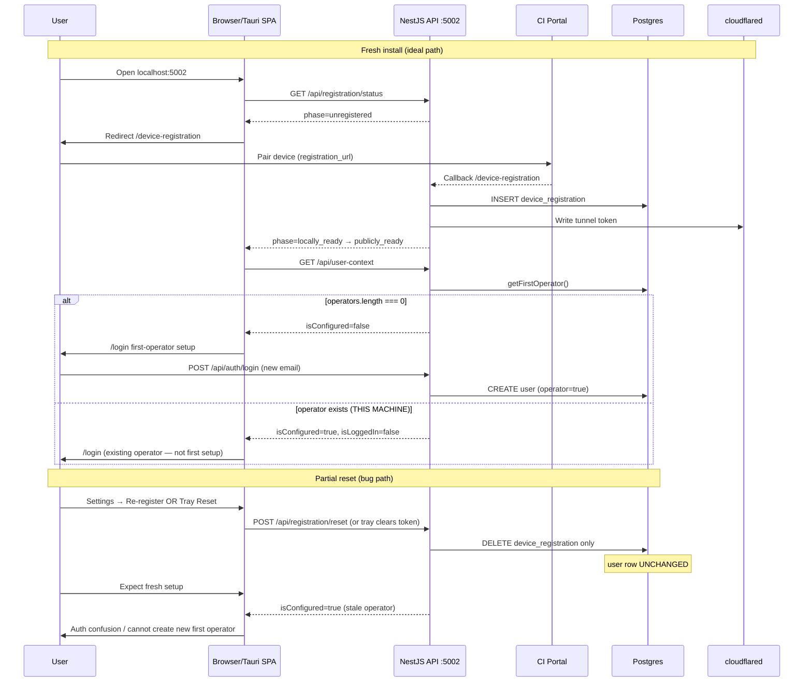

# Agent 1 — CI-Hub Full System Audit

**Branch:** `style/onboarding-light-mode-colors`  
**Machine:** beta-1  
**Date:** 2026-06-23  
**Auditor:** Agent 1 (architecture map, live diagnostics, flow walkthrough)

---

## Executive summary

The hub stack is **up and healthy** for local API access (`localhost:5002`). Core blockers for a “fresh install” experience are **partial reset semantics** (operator row survives most reset paths) and **stale `ci.lan` defaults** in `/api/user-context` and frontend context. Public tunnel hostname is registered in Portal but **not reachable externally** (`locally_ready` not `publicly_ready`). Ollama runs on the host (13 models) but is **unreachable from the hub container**, which will break onboarding AI detection.

---

## 1. Live diagnostic log

Captured 2026-06-23 on beta-1 with `cihub up dev` active.

### API health and latency

| Endpoint | Latency | HTTP |
|----------|---------|------|
| `/api/health` | 1.5 ms | 200 |
| `/api/registration/status` | **6.3 s** (cold), ~2 ms (warm) | 200 |
| `/api/user-context` | 520 ms | 200 |

### Registration and device

```json
{
  "phase": "locally_ready",
  "degradedReasons": [],
  "registered": true
}
```

```json
{
  "device_id": "06151e8ba400470cb48c67ae51d297a9",
  "registration_url": "https://hub.companionintelligence.com/device/register?device_id=...&callback_url=http%3A%2F%2Flocalhost%3A5002%2Fdevice-registration",
  "callback_url": "http://localhost:5002/device-registration",
  "ci_cloud_url": "https://hub.companionintelligence.com"
}
```

**Validated:** Registration callback URL is already `localhost:5002` (good).

### User context (bug confirmed)

```json
{
  "isLoggedIn": false,
  "isConfigured": true,
  "localDomain": "ci.lan",
  "domain": "companionintelligence.com",
  "isPasswordResetDisabled": true
}
```

Container env: `DOMAIN=companionintelligence.com`, `LOCAL_DOMAIN` unset.  
`settings.json`: `localDomain: null`.  
Root cause: `app.controller.ts` falls back to `DEFAULT_LOCAL_DOMAIN` (`ci.lan`) when `userSettings.localDomain` is null, **without** reading `configuration.get('localDomain')` (which would resolve to `companionintelligence.com` per `configuration.service.ts`).

### Database

```sql
SELECT id, username FROM "user";
-- 1 | chamberlain.bennett@gmail.com

SELECT app_name, status, exposure_mode FROM app;
-- ci-openclaw | running | cloudflare
```

`device_registration`: 1 row, `provisioning_phase = locally_ready`, tunnel active.

### Containers (`cihub status dev`)

| Container | Status |
|-----------|--------|
| ci-os-hub | Up 3h (healthy) :5002 |
| ci-hub-db | Up 3h (healthy) :6543 |
| hub-tailscale | Up (healthy) |
| ci-os-hub-queue | Up 3h (healthy) |
| cloudflared | Up 3h |
| traefik | Up 3h |

### Volumes

```
local  ci_hub_pgdata
```

### Public hostname probe

```bash
curl --max-time 10 https://hub-beta1-devben.companionintelligence.com/api/health
# → timeout (unreachable)
```

Matches backend warn: `public hostname hub-beta1-devben.companionintelligence.com not yet reachable`.

### Ollama

| Probe | Result |
|-------|--------|
| Host `localhost:11434` | **OK** — 13 models |
| Hub container `host.docker.internal:11434` | **TIMEOUT** |
| Hub container `172.17.0.1:11434` | **TIMEOUT** |
| `OLLAMA_URL` in container | `http://host.docker.internal:11434` |

Likely cause: Ollama bound to `127.0.0.1` only, or host firewall blocking Docker bridge. Code already documents fix: `OLLAMA_HOST=0.0.0.0:11434`.

### Backend log highlights

- Tunnel token loaded from disk (180 chars)
- Registration validation passed in Portal
- Repeated warn: public hostname not yet reachable
- `[AppMonitor] CPU summary: Companion Hub 1771.5% CPU` (single sample spike; see defect #8)

### Password reset API

```bash
POST /api/auth/password-reset/request {"email":"chamberlain.bennett@gmail.com"}
→ {"success":true,"message":"If this email is registered..."}
```

Portal session hint returns operator email — confirms existing operator.

---

## 2. Architecture map (validated)

### Layer A — Desktop / packaging

| File | Role | Notes |
|------|------|-------|
| `packages/desktop/src-tauri/src/hub_manager.rs` | Seeds `~/.local/share/companion-hub/` with `.env`, compose | Canonical prod data dir |
| `packages/desktop/src-tauri/src/tray.rs` | Tray start/stop/**reset** | **Reset = stop containers + clear tunnel token only** — no DB wipe |
| `packages/desktop/src-tauri/tauri.conf.json` | `devUrl: http://localhost:5005` | Frontend dev server separate from API :5002 |

### Layer B — CLI / compose

| File | Role | Notes |
|------|------|-------|
| `scripts/cihub-cli.ts` | `resetHub()` → `downHub({ volumes: true })` + `cleanHub()` | Full wipe path exists for CLI |
| `scripts/lib/paths.ts` | `resolveCanonicalDataDir()`, appliance context | Appliance vs repo mode |
| `docker-compose.prod.yml` | `ci_hub_pgdata`, API :5002, `OLLAMA_URL`, `host-gateway` | Traefik labels use `ci-os-hub.local` |

### Layer C — Backend

| File | Role | Notes |
|------|------|-------|
| `packages/backend/src/main.ts` | CORS for localhost, tauri, DOMAIN | — |
| `configuration.service.ts` | `LOCAL_DOMAIN → DOMAIN → DEFAULT_LOCAL_DOMAIN` | Config resolves correctly |
| `app.controller.ts` | `/api/user-context` | **Bug:** uses `DEFAULT_LOCAL_DOMAIN` when settings null |
| `registration.service.ts` | `resetRegistration()` | Clears device_registration + tunnel token; **no user wipe** |
| `auth.service.ts` | `ensureLocalCompanionUser()` | First operator only when `operators.length === 0` |
| `apps.service.ts` / `app-access-points` | Local apps → `127.0.0.1:{port}` | Already migrated in app details UI |

**Missing:** `factory-reset` module — grep returns zero matches on this branch.

### Layer D — Frontend

| File | Role | Notes |
|------|------|-------|
| `root.tsx` | Gates registration + `isConfigured` | Redirects to `/login` when configured but logged out |
| `tauri-hub-probe.ts` | Probes `localhost:5002/5004` | Tauri release waits for API |
| `api-fetch.ts` | Session/credentials handling | Password-reset credentials fix on branch |
| `user-context.tsx` | Default `localDomain: 'ci.lan'` | Stale until API loads |
| `guest-dashboard.tsx` | Opens `https://{sub}.{localDomain}` | **Still ci.lan hostname pattern** |
| `network-settings.tsx` | "Re-register device" → `POST /api/registration/reset` | Pairing reset only |

### Layer E — Portal (separate repo)

- `ci-portal` branch `fix/reregister-dns` — preserve tunnel on re-register (Agent 3 / separate PR)

---

## 3. User flow matrix (F1–F10)

| Flow | Entry | Result | Evidence |
|------|-------|--------|----------|
| **F1** Cold start | `cihub status dev` | **PASS** | All 6 hub containers healthy; dashboard `http://localhost:5002` |
| **F2** First operator / login | `/login` | **FAIL** | `isConfigured: true`, user `chamberlain.bennett@gmail.com` in DB; not first-setup flow. New email login would hit `AUTH_ERROR_USER_NOT_FOUND` if operators exist |
| **F3** Device registration | `/device-registration` | **PARTIAL** | `registered: true`, phase `locally_ready` (not `publicly_ready`); callback URL correct; public hostname unreachable |
| **F4** Restore device | Portal re-pair | **NOT EXERCISED** | `state-drift` API: `detected: false`; Portal session-hint returns operator — no drift signals |
| **F5** Password reset | `/reset-password` | **PASS** (API) | Page 200; `POST /api/auth/password-reset/request` succeeds; UI flag `isPasswordResetDisabled: true` may hide UI affordance |
| **F6** App install (local) | App store | **PARTIAL** | Only installed app is `ci-openclaw` (`cloudflare` exposure); `app-access-points.tsx` uses `127.0.0.1` in code — not re-tested with local app |
| **F7** App install (public) | Cloudflare tunnel | **FAIL** | `https://hub-beta1-devben.companionintelligence.com` times out; phase stuck at `locally_ready` |
| **F8** Factory / full reset | Settings / `cihub reset` | **FAIL** | User row persists; `ci_hub_pgdata` volume present; no factory-reset API; tray reset ≠ full wipe; Settings reset is registration-only |
| **F9** Onboarding / AI | `/onboarding` | **FAIL** | Page 200; Ollama on host OK but **unreachable from hub container**; `/api/inference/onboarding-profile` requires auth |
| **F10** Tauri desktop | `pnpm run dev:desktop` | **NOT RUN** | Code review: probe ports 5002/5004, `devUrl` :5005, session header for release builds — manual desktop session not executed in this audit |

**Summary:** 2 PASS, 3 PARTIAL, 4 FAIL, 1 NOT RUN

---

## 4. Top 10 defects (by user impact)

| Rank | Defect | Impact | Reproduction |
|------|--------|--------|--------------|
| 1 | **Partial reset leaves operator user** | Users cannot get first-login / setup flow after "reset" | DB query shows user after tray or registration reset; `isConfigured: true` |
| 2 | **`/api/user-context` returns `localDomain: "ci.lan"`** | Wrong app URLs in guest dashboard and install UI | `curl localhost:5002/api/user-context \| jq .localDomain` → `ci.lan` while `DOMAIN=companionintelligence.com` |
| 3 | **Public hostname unreachable** | Remote access broken; phase never `publicly_ready` | `curl https://hub-beta1-devben.companionintelligence.com/api/health` times out; logs warn DNS |
| 4 | **No factory-reset API** | No in-app full wipe; inconsistent with user expectations | `grep factory-reset packages/` → empty |
| 5 | **Tray "Reset Hub" misleading** | Users think hub is fresh; operator + DB remain | Tray menu clears tunnel token only (`tray.rs`); restart → still configured |
| 6 | **Guest dashboard uses `https://{sub}.{localDomain}`** | Broken local links when `localDomain` is ci.lan | `guest-dashboard.tsx` lines 35–36 |
| 7 | **Ollama unreachable from Docker hub** | Onboarding AI / inference detection fails | Host has 13 models; container curl to `host.docker.internal:11434` times out |
| 8 | **AppMonitor CPU spike reporting** | False alarms / noisy logs; possible misread of multi-core docker stats | Log: `Companion Hub 1771.5% CPU` then back to &lt;10% |
| 9 | **`/api/registration/status` cold latency ~7s** | Slow first page load after idle | First curl 6.8s; subsequent &lt;2ms (likely DNS/tunnel validation on cold path) |
| 10 | **Settings "Re-register device" ≠ full reset** | Operator expects clean slate; only pairing cleared | `POST /api/registration/reset` — `resetRegistration()` does not touch `user` table |

---

## 5. Sequence diagram — registration + auth bootstrap



---

## 6. Handoff notes

### To Agent 2 (ci.lan → localhost migration)

**Priority surfaces confirmed live:**

1. `packages/backend/src/app.controller.ts` — line 49 defaults and line 74 `userSettings?.localDomain || defaults.localDomain` — should use `configuration.get('localDomain')`.
2. `packages/frontend/src/context/user-context.tsx` — default `'ci.lan'` (uncommitted diff on branch may already touch this).
3. `packages/common/constants.ts` — `DEFAULT_LOCAL_DOMAIN = 'ci.lan'`.
4. `packages/frontend/src/modules/dashboard/pages/guest-dashboard.tsx` — hostname-based open still present.
5. i18n placeholders in `packages/common/i18n/translations/*.json`.

**Verification baseline after your fixes:**

```bash
curl -s http://localhost:5002/api/user-context | jq .localDomain
# expect: companionintelligence.com or localhost — NOT ci.lan
```

**Intentional ci.lan references to evaluate (not necessarily remove):**

- `cloudflare-client.service.ts`, `identity.ts` — tunnel `originServerName` for Traefik routing
- Test fixtures (~40 files) — update in P3

**Do not test F2 first-login until Agent 3 runs `cihub reset dev --yes`.**

### To Agent 3 (reset / auth / git)

**Reset semantics (confirmed):**

| Surface | Wipes users? | Wipes `ci_hub_pgdata`? | Wipes tunnel? |
|---------|--------------|------------------------|---------------|
| Tray reset | No | No | Yes (token file) |
| `POST /api/registration/reset` | No | No | Yes |
| `cihub reset dev --yes` | Yes (if `-v` succeeds) | Yes | Yes (via `cleanHub`) |

**Auth blocker on this machine:** `chamberlain.bennett@gmail.com` operator id=1 — blocks `ensureLocalCompanionUser()` for any other email.

**Factory reset:** No `packages/backend/src/modules/system/factory-reset.*` on branch — implement per plan §3.3.

**Git:** 14 uncommitted files on branch (Sentry, chunk-load, tauri theme, contexts, error-reporting, app-details-tabs, cihub-cli) — split per plan §3.5.

**Immediate unblock command (Agent 3 should run before Agent 2 tests F2):**

```bash
cd /home/ci/devel/CI-Hub
cihub down dev
cihub reset dev --yes
docker volume ls | grep ci_hub_pgdata || echo "pg volume gone OK"
cihub up dev --detached
```

**EACCES risk:** `cleanHub` on `/home/ci/devel/hub-data` may need `docker run --rm -v ... alpine rm -rf /d/*` if root-owned files exist.

---

## 7. Additional observations

- **Registration status latency:** First request after idle triggers expensive validation (~7s). Consider caching or async refresh for UX.
- **Password reset disabled flag:** `isPasswordResetDisabled: true` in user-context while API endpoint works — verify UX gating vs Portal-only reset.
- **ci-openclaw:** Running as cloudflare-exposed app; public URL untestable until tunnel DNS resolves.
- **ufw:** Could not inspect (`sudo` unavailable in audit shell); Ollama bridge failure may be bind address not firewall.
- **Portal SSO:** `GET /api/auth/portal/session-hint` returns operator email — SSO path available for existing operator.

---

*End of Agent 1 audit. No code fixes applied (diagnostic-only scope).*
