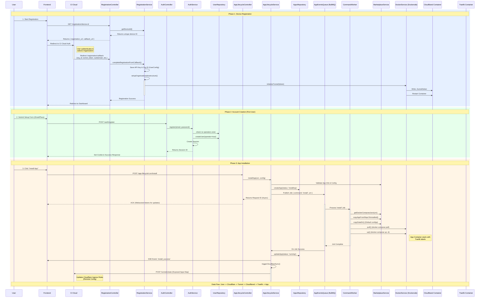

# CI-OS-Hub Backend Architecture

This document outlines the happy path flows for the CI-OS-Hub backend.

## Happy Path Flow Diagram

The following sequence diagram illustrates the three key phases of user interaction: Device Registration, Account Creation, and App Installation.

## Module Descriptions

### Core Layer
- **ConfigurationModule**: Manages environment variables and application config.
- **DatabaseModule**: Handles database connections (PostgreSQL/SQLite via Drizzle).
- **CacheModule**: Provides caching services (Redis/Memory).
- **FilesystemModule**: Abstraction for file system operations.
- **QueueModule**: Manages background jobs (BullMQ).
- **SSEModule**: Handles Server-Sent Events for real-time frontend updates.

### Integration Layer
- **DockerModule**: Wrapper around `dockerode` to interact with the Docker daemon.
- **GithubModule**: Utilities for interacting with GitHub APIs (for app stores/updates).

### App Management Domain
- **AppsModule**: Manages the `App` entities, persistent state of installed applications.
- **AppLifecycleModule**: The orchestration engine. Handles installation, starting, stopping, and uninstalling apps. Coordinates with Docker and Nginx/Traefik.
- **MarketplaceModule**: Aggregates available apps from configured App Stores.
- **AppStoreModule**: Manages the sources (git repos) where apps are defined.
- **EnvModule**: Manages `.env` files and environment variable injection for apps.

### User & Auth Domain
- **AuthModule**: Authentication logic (JWT, Session).
- **UserModule**: User profile management.

### System & Operations
- **SystemModule**: Provides host system information (RAM, CPU, usage).
- **BackupsModule**: Manages full system backups and restores.
- **RegistrationModule**: Handles linking the instance to the CI-Cloud.
- **CloudflareModule**: Manages Cloudflare Tunnels for remote access.
