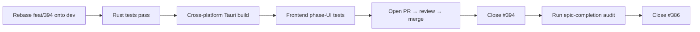

# Epic #386 — Hardening, FTUE & Production-Readiness

**Issue:** [#386](https://github.com/companionintelligence/CI-Hub/issues/386)
**Status:** 7 of 8 child issues closed (~88% complete)
**Single remaining blocker:** [#394](https://github.com/companionintelligence/CI-Hub/issues/394) — desktop startup health-awareness + first-run diagnostics
**Date:** 2026-05-18

---

## 1. At a Glance

| Dimension | Value |
|---|---|
| Original scope | 11 sub-issues (8 implementation + 3 cross-cutting) |
| Closed | #387, #388, #389, #390, #391, #392, #393, #395, #396, #397 |
| Open | **#394** only |
| In-flight branch | `feat/394-health-aware-startup` (last commit 2026-04-28 — PR review feedback already addressed) |
| Estimated to close epic | **~3–5 days** (drive #394 to merge + epic-completion checklist) |
| Blocking launch | **Yes** — #394 is on the launch-critical FTUE path |

The hard work of this epic has shipped. What's left is one focused desktop-PR landing + a completion-criteria audit.

---

## 2. Goal

> Eliminate the gap between **what the product says is true** and **what the system has actually confirmed** during first run, app lifecycle operations, desktop startup, and release gating.

Once #394 lands, the epic's five completion criteria can each be ticked:

| Completion criterion (from issue body) | Status |
|---|---|
| Registration, provisioning, lifecycle & control-plane state are explicit + truthful | ✅ via #388, #389, #390, #395 |
| Desktop runtime is storage-consistent, health-aware, diagnosable | 🟡 #393 done (storage); **#394 needed** (health + diagnostics) |
| Onboarding, ownership, store context, update review tell the truth | ✅ via #391, #392 |
| Docs, naming, release architecture reflect current product | ✅ via #396 |
| Launch-critical verification required in CI | ✅ via #397 |

---

## 3. Current State

### What shipped (snapshot of merged PRs touching these areas)

- **#387 Verification foundation** → closed. Reusable harness for registration / lifecycle / desktop / multi-store flows.
- **#388 Registration & provisioning state model** → closed. Explicit state machine in Hub APIs.
- **#389 Portal ↔ Hub handoff + UX** → closed. Truthful and resilient device-pair handshake.
- **#390 Lifecycle persistence** → closed. State committed before SSE emission (see also #425 which goes deeper).
- **#391 Onboarding + nav truthfulness** → closed.
- **#392 App ownership + multi-store UX** → closed.
- **#393 Desktop app-data storage contract** → closed.
- **#395 RabbitMQ / Traefik / session / update hardening** → closed.
- **#396 Docs / naming / release** → closed. Notable artifacts: [`docs/ARCHITECTURE.md`](../docs/ARCHITECTURE.md), [`docs/PLATFORM_ARCHITECTURE.md`](../docs/PLATFORM_ARCHITECTURE.md), [`docs/FLYWHEEL.md`](../docs/FLYWHEEL.md).
- **#397 Launch CI gates** → closed.

### What's open

#### [#394 — Make desktop startup health-aware + first-run diagnostics](https://github.com/companionintelligence/CI-Hub/issues/394)
- **Depends on:** #393 (done).
- **Active branch:** `feat/394-health-aware-startup` (HexaField, 2026-04-28: *"fix: address PR review comments from Copilot"*).
- **Status:** PR review feedback addressed in April; no PR open on GitHub — branch sitting unmerged.
- **Likely reason for stall:** needs a final reviewer pass + rebase against `dev` (which has moved significantly since April).

---

## 4. Remaining Work — #394 Decomposition

The acceptance criteria (paraphrased from the issue body) translate to four concrete work items on the existing branch:

| Item | Files | What "done" looks like |
|---|---|---|
| 1. Persist desired state separately from observed state | [`packages/desktop/src-tauri/src/hub_manager.rs`](../packages/desktop/src-tauri/src/hub_manager.rs) | New `DesiredState { Running, Stopped }` persisted to `<data_dir>/desired-state.json`; readable on next launch. |
| 2. Health-aware readiness (replace existence checks) | [`packages/desktop/src-tauri/src/hub_manager.rs`](../packages/desktop/src-tauri/src/hub_manager.rs), [`main.rs`](../packages/desktop/src-tauri/src/main.rs) | `HubStatus::Running` only after `/api/health` returns 200 AND Postgres + RabbitMQ + Traefik are each reachable. Today's check is *container existence*. |
| 3. Phase-level UI signal | [`packages/frontend/src/components/hub-status/**`](../packages/frontend/src/components/hub-status), Tauri command exposing `StartupProgress` | UI shows e.g. `"Starting Postgres…" → "Starting queue…" → "Waiting for Hub API…" → "Ready"`. Plumbing already exists via `get_startup_progress_command` in [`main.rs`](../packages/desktop/src-tauri/src/main.rs); UI needs to consume it. |
| 4. Respect intentional user-stop | [`hub_manager.rs`](../packages/desktop/src-tauri/src/hub_manager.rs), [`tray.rs`](../packages/desktop/src-tauri/src/tray.rs) | When user clicks tray "Stop Hub", record `desired=Stopped`; on next app launch, do not auto-`docker compose up` until user clicks "Start Hub". |

### Recommended path to merge

1. **Rebase** `feat/394-health-aware-startup` onto current `dev` (significant drift since April — fleet QA, ollama scripts, Tailscale changes, refactor PRs landed).
2. **Rerun the Rust unit tests** and re-verify Tauri build on macOS + Linux (already-merged April CI changes may have broken expectations).
3. **Open the PR** against `dev` (does not appear to have one — `gh pr list` shows none for that branch).
4. **Frontend test addition** if missing — phase-level UI rendering (mentioned in the issue's "Required automated coverage").
5. **Live verification** per the issue's "Required end-to-end / live verification" checklist (cold start, delayed-dependency, user-stop preserved across relaunch).

### Sequencing

---

## 5. Risks

| Risk | Likelihood | Impact | Mitigation |
|---|---|---|---|
| Branch has drifted too far to rebase cleanly | Med | Med | Bisect-and-recreate vs. rebase if conflicts are heavy in `hub_manager.rs` |
| Phase-UI design diverges from #391's nav-truthfulness work | Low | Med | Reuse `hub-status` component contract from #391 rather than introducing a parallel one |
| Cross-platform startup differences (macOS vs Linux vs Windows) | Med | Med | Run live verification on all three before merge; #394 acceptance doesn't mention Windows but `feat/tauri-windows-willbuild` exists |
| User-stop semantics conflict with auto-restart logic in `start.ts` | Low | Low | Limit auto-restart to "Hub was running last time AND no explicit stop"; document the precedence |

---

## 6. Acceptance Criteria — Epic Close-Out

Once #394 merges, run this checklist before closing #386:

- [ ] **Backend:** registration + provisioning + lifecycle + control-plane state machines all have explicit enum types and integration tests (#388/#389/#390/#395 already cover this; just re-verify).
- [ ] **Desktop:** startup no longer uses container existence as a proxy for healthy readiness; phase-level UI signals visible; intentional stop preserved.
- [ ] **Frontend:** onboarding + nav + ownership UI sources reflect committed backend state (no optimistic stale renders).
- [ ] **Docs:** [`docs/ARCHITECTURE.md`](../docs/ARCHITECTURE.md), [`docs/PLATFORM_ARCHITECTURE.md`](../docs/PLATFORM_ARCHITECTURE.md), README all describe current product (verified 2026-05-18: they do).
- [ ] **CI:** launch-critical E2E required (re-confirm with `gh workflow list` that the gates from #397 are still enabled and not silently skipped).

---

## 7. Open Questions

1. **Branch ownership** — the active branch is HexaField's. If they're no longer driving, who picks it up? Worth a comment on the issue to confirm.
2. **Windows scope** — desktop completion criteria doesn't enumerate Windows, but `feat/tauri-windows-willbuild` exists. Is Windows in scope for the epic-close or deferred to a follow-up?
3. **Re-verify #397** — closed but was it self-reported or audited? Worth one re-check that the launch-critical jobs are still `required` in branch protection rather than informational.

---

## 8. References

- Epic: [#386](https://github.com/companionintelligence/CI-Hub/issues/386)
- Open sub-issue: [#394](https://github.com/companionintelligence/CI-Hub/issues/394)
- In-flight branch: [`feat/394-health-aware-startup`](https://github.com/companionintelligence/CI-Hub/compare/dev...feat/394-health-aware-startup)
- Related: [#418](https://github.com/companionintelligence/CI-Hub/issues/418) (follow-on truth-contract refactor — see [`planning/epic-418-truth-contract-refactor.md`](epic-418-truth-contract-refactor.md))
- Doc artifacts from this epic: [`docs/ARCHITECTURE.md`](../docs/ARCHITECTURE.md), [`docs/PLATFORM_ARCHITECTURE.md`](../docs/PLATFORM_ARCHITECTURE.md), [`docs/FLYWHEEL.md`](../docs/FLYWHEEL.md)
