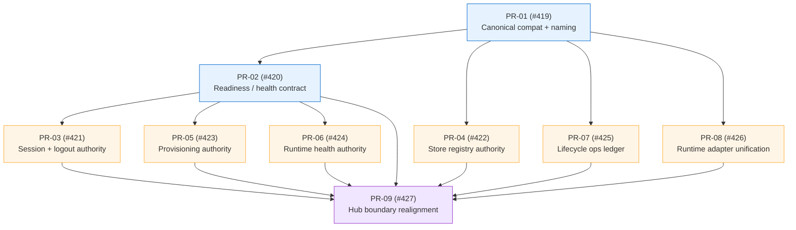

# Epic #418 — Truth-Contract Refactor (post-hardening architecture)

**Issue:** [#418](https://github.com/companionintelligence/CI-Hub/issues/418)
**Status:** All 9 child issues open ([#419](https://github.com/companionintelligence/CI-Hub/issues/419)–[#427](https://github.com/companionintelligence/CI-Hub/issues/427))
**Depends on:** [#386](https://github.com/companionintelligence/CI-Hub/issues/386) ([planning doc](epic-386-hardening-ftue.md)) — should ship before #418 starts
**Date:** 2026-05-18

---

## 1. At a Glance

| Dimension | Value |
|---|---|
| Child issues | 9 ([#419](https://github.com/companionintelligence/CI-Hub/issues/419) → [#427](https://github.com/companionintelligence/CI-Hub/issues/427)) |
| Closed | 0 |
| Active branches | `feat/dag-pr04-lifecycle-ledger`, `feat/dag-pr05-foundation-registration-lifecycle-integration` (both stale at 2026-04-18) |
| Estimated total | **6–8 weeks** sustained engineering time for one engineer; **3–4 weeks** with two engineers working in parallel after PR-01/PR-02 land |
| Risk profile | **Medium** — refactor, not rewrite; biggest risk is scope creep into the surrounding modules |

This is a **stacked-PR program** with a strict DAG. The epic body explicitly calls out non-goals: no microservice split, no NestJS rewrite, no frontend IA rewrite, no Portal/Marketplace coordination required.

---

## 2. Goal

Move CI-Hub from a working-but-noisy control plane to one with:
- **Canonical shared contracts** in `@ci-hub/common` (single vocabulary for compatibility, readiness, health, lifecycle state).
- **Sharper internal authorities** — one place that owns each truth (store registry, provisioning, runtime health, lifecycle ledger).
- **Mechanism/policy separation** — adapters (routing, queue, desktop runtime env) decoupled from domain modules.
- **Externalised truth over in-memory drift** — durable operation ledger drives SSE rather than callback timing.
- **Reduced monolithic concentration** — Hub stops being the bag for control-plane concerns that belong in a clear authority.

This is what the epic body calls "a truth-and-boundary refactor."

---

## 3. Current State

### Active prior art
- `feat/dag-pr04-lifecycle-ledger` (2026-04-18, HexaField) — touches the **#425 ledger** workstream. Stale 4 weeks.
- `feat/dag-pr05-foundation-registration-lifecycle-integration` (2026-04-18) — touches the **#423 provisioning authority** + integration. Stale.

Both branches predate substantial refactors that landed in May (`feat/enhance`, the openclaw entrypoint hardening, multi-arch builds). Likely need to be **superseded** rather than rebased.

### Code surfaces already in scope
Quick map of the modules each child issue is about to touch:

| Issue | Primary modules / paths |
|---|---|
| #419 compatibility/naming | [`packages/common/src/schemas/`](../packages/common/src/schemas), [`packages/common/src/types/`](../packages/common/src/types), [`packages/backend/src/modules/marketplace/`](../packages/backend/src/modules/marketplace) |
| #420 readiness/health contract | [`packages/backend/src/core/health/`](../packages/backend/src/core/health), [`packages/backend/src/modules/registration/`](../packages/backend/src/modules/registration), [`packages/backend/src/modules/system/`](../packages/backend/src/modules/system) |
| #421 session transport + logout | [`packages/backend/src/modules/auth/`](../packages/backend/src/modules/auth) |
| #422 store registry authority | [`packages/backend/src/modules/app-stores/`](../packages/backend/src/modules/app-stores), [`packages/backend/src/modules/marketplace/`](../packages/backend/src/modules/marketplace) |
| #423 provisioning authority | [`packages/backend/src/modules/registration/`](../packages/backend/src/modules/registration) |
| #424 runtime health authority | [`packages/backend/src/core/health/`](../packages/backend/src/core/health), [`packages/backend/src/modules/system/`](../packages/backend/src/modules/system) |
| #425 lifecycle operations ledger | [`packages/backend/src/modules/app-lifecycle/`](../packages/backend/src/modules/app-lifecycle), [`packages/backend/src/modules/queue/`](../packages/backend/src/modules/queue), new ledger table in [`packages/backend/src/core/database/drizzle/`](../packages/backend/src/core/database/drizzle) |
| #426 runtime adapter unification | [`packages/backend/src/modules/docker/`](../packages/backend/src/modules/docker) (Traefik), [`packages/backend/src/modules/queue/`](../packages/backend/src/modules/queue) (RabbitMQ), [`packages/desktop/src-tauri/src/hub_manager.rs`](../packages/desktop/src-tauri/src/hub_manager.rs) (env) |
| #427 boundary realignment | Cross-cutting; consolidates the above into a coherent module layout |

---

## 4. Stacked-PR Program

The DAG from the epic body:

### Workstream detail

#### PR-01 / #419 — Canonical compatibility & naming
- **Pick the vocabulary.** Currently the codebase still uses both `tipi.*` and `hub.*` in places (lockfile, some env vars, the `ci_os_hub_network`). Decide on `hub` as canonical; relegate `tipi` to legacy-translation layers.
- **Deliverable:** new module under [`packages/common/src/schemas/compatibility.ts`](../packages/common/src/schemas) exporting `AppCompatibility`, `HubCompatibility` zod schemas + types.
- **Translation seams:** keep the legacy names in `MarketplaceService::getAppInfo` ingestion only; nothing downstream of marketplace should see them.
- **Done when:** `grep -r tipi packages/` returns only schema translation files + lockfile/build artifacts.
- **Est:** 3–5 days.

#### PR-02 / #420 — Readiness, degraded-state, health contract
- **Define a shared enum** like `HealthState = Healthy | Degraded(reason) | Down(reason)`; a `Readiness = { local: HealthState, public: HealthState, components: Record<string, HealthState> }`.
- **Health endpoint contract** in [`packages/backend/src/core/health/health.controller.ts`](../packages/backend/src/core/health/health.controller.ts) emits the new shape.
- **Consumers updated:** desktop tray status, frontend hub-status component, E2E helpers.
- **Done when:** local vs public readiness are *each* explicit in the API; UI distinguishes "Hub is up but Cloudflare tunnel is degraded" from "Hub is down."
- **Est:** 4–6 days.
- **Note:** strong overlap with #394 (still open under [#386](epic-386-hardening-ftue.md)) — coordinate so #394 doesn't ship a parallel model that then has to be migrated.

#### PR-03 / #421 — Session transport & logout
- **Problem today:** authentication uses cookie sessions for browser UI and (per [`packages/frontend/src/root.tsx:54`](../packages/frontend/src/root.tsx)) `credentials: 'omit'` for Tauri (so Tauri must use a separate transport).
- **Single authority** in [`packages/backend/src/modules/auth/`](../packages/backend/src/modules/auth) that mints both cookie sessions and bearer tokens, with one logout path that revokes both.
- **Done when:** there is one `AuthService::issue()` / `revoke()` API; transport is a config detail, not a module split.
- **Est:** 4–7 days.

#### PR-04 / #422 — Store registry authority
- **Problem today:** [`AppStoreService`](../packages/backend/src/modules/app-stores/app-store.service.ts) and [`MarketplaceService`](../packages/backend/src/modules/marketplace/marketplace.service.ts) both reach into store state. There's a `TODO: This is a temporary fix to ensure that internal app stores are always present.` in `marketplace.service.ts:55` that suggests the boundary isn't right.
- **Single registry** behind one interface: `registerStore`, `getStore`, `listEnabledStores`, `pullAll`, `refresh`.
- **Marketplace becomes a consumer** rather than co-owner of store state.
- **Est:** 5–8 days.

#### PR-05 / #423 — Provisioning authority
- **Problem today:** registration logic in [`packages/backend/src/modules/registration/registration.service.ts`](../packages/backend/src/modules/registration/registration.service.ts) carries both **device pairing** semantics and **org provisioning** (tunnel init, cloudflare client, settings persistence).
- **Split:** `RegistrationService` handles the pair-handshake only; new `ProvisioningService` owns "what does it mean to be a pristine vs. provisioned vs. operational device" and is the source for readiness contract from #420.
- **Likely supersedes the stale `feat/dag-pr05-...` branch** rather than rebasing it.
- **Est:** 5–8 days.

#### PR-06 / #424 — Runtime health authority
- **Problem today:** health-related code lives in [`core/health/`](../packages/backend/src/core/health), [`modules/system/`](../packages/backend/src/modules/system), partly in `modules/cloudflare/`, and the desktop has its own in [`hub_manager.rs::get_hub_status`](../packages/desktop/src-tauri/src/hub_manager.rs).
- **One authority** owns the runtime view; everyone else consumes via the #420 contract.
- **Done when:** there's one place that knows "the Hub is healthy" and the tray + frontend + Portal sync all read from it.
- **Est:** 4–6 days.

#### PR-07 / #425 — Lifecycle operations ledger
- **Problem today:** lifecycle commands publish to RabbitMQ and emit SSE on callback completion. Callback timing can race UI state ("install_success" SSE arrives before DB row updates). #390 already moved most state-writes before emission, but the model is still ad-hoc per-command.
- **Deliverable:** new table `app_lifecycle_operation { id, app_urn, command, requested_at, started_at, completed_at, success, message }`; SSE events derive from `INSERT INTO app_lifecycle_operation` triggers rather than callbacks.
- **Likely supersedes `feat/dag-pr04-lifecycle-ledger`** branch (stale).
- **Est:** 6–9 days. Largest of the parallel workstreams.

#### PR-08 / #426 — Runtime adapter unification
- **Problem today:** routing (Traefik), queue (RabbitMQ), desktop env (Tauri-managed `.env`) each have ad-hoc interaction patterns. Hub modules import service classes directly.
- **Deliverable:** define adapter interfaces (`Router`, `Queue`, `RuntimeEnv`) in [`packages/backend/src/core/`](../packages/backend/src/core); concrete Traefik / RabbitMQ / Tauri impls implement them; modules depend on the interface.
- **Est:** 5–8 days.

#### PR-09 / #427 — Hub boundary realignment
- **Problem today:** module-vs-core split has drifted; some modules host concerns that should be core (config, queue) and vice versa.
- **Deliverable:** reorganize `packages/backend/src/modules/` and `packages/backend/src/core/` per the seams established by PR-01..PR-08. Largely mechanical once contracts exist.
- **Est:** 3–5 days.

### Total estimate

| Path | Sequential | With 2 engineers parallel after PR-02 |
|---|---|---|
| **Optimistic** | 39 days | 24 days |
| **Likely** | 52 days | 32 days |
| **Pessimistic** | 67 days | 45 days |

---

## 5. Sequencing Recommendation

1. **Close #386 first** ([planning doc](epic-386-hardening-ftue.md)) — #394 will likely touch the same `hub-status` UI as #420. Coordinate or risk merge-conflict thrash.
2. **Land PR-01 (#419) solo.** It's small, it's foundational, every other PR depends on the vocabulary.
3. **Land PR-02 (#420) solo.** Same — health/readiness contract is consumed by half the remaining PRs.
4. **Parallelize after PR-02 merges**, ideally across two engineers:
   - **Engineer A:** PR-03 (auth) → PR-05 (provisioning) → PR-06 (health)
   - **Engineer B:** PR-04 (stores) → PR-07 (lifecycle ledger) → PR-08 (adapters)
5. **PR-09 (#427) is the convergence PR.** Reorganization should be its own well-scoped change, not bundled with any of the authority PRs. Land after all others.

---

## 6. Risks

| Risk | Likelihood | Impact | Mitigation |
|---|---|---|---|
| Stale branches (`feat/dag-pr04/05`) have unmerged design ideas we lose | Med | Med | Read those PRs' diffs before scrapping; copy useful tests/abstractions |
| #420 contract conflicts with #394's still-in-flight model | High | Med | Land #386/#394 first (per §5); have one author own both |
| Scope creep — refactor turns into rewrite | High | High | Use the epic body's "Explicit non-goals" as the gate; PRs that touch >2k LoC outside their scope get split |
| Generated client churn (api-client) becomes a constant rebase headache | High | Low | Regenerate via `pnpm gen:swagger && pnpm gen:api-client` as a post-merge step on each PR; don't commit `*.gen.ts` mid-stack |
| Two engineers' parallel PRs touch the same `app-lifecycle` files | Med | Med | Reserve `app-lifecycle/**` for PR-07's author until #425 merges, then unblock #426 |
| Database migration for #425 ledger introduces lock-time risk for existing orgs | Low | High | The Hub is single-tenant per device (no multi-org sharing) — no real lock risk, but add the table behind a feature flag for one release |

---

## 7. Acceptance Criteria — Epic Close-Out

Per the epic body + reasonable inference:

- [ ] **One canonical compatibility contract** in `@ci-hub/common`; `tipi` only at translation boundaries.
- [ ] **One readiness/health contract** consumed by health endpoint, frontend, desktop tray, Portal sync, E2E.
- [ ] **One auth authority** mints both cookie + bearer with a single revoke path.
- [ ] **One store registry** owns enabled stores; marketplace is a pure consumer.
- [ ] **Provisioning is separated from registration**; readiness derives from provisioning state.
- [ ] **One runtime health authority** is the only source of "is the Hub healthy."
- [ ] **Lifecycle ledger table** is the source of truth for SSE; tests assert state-before-event ordering.
- [ ] **Runtime adapters** are interface-based; concrete impls (Traefik, RabbitMQ, Tauri env) can be swapped without touching modules.
- [ ] **Module layout** reflects the new seams (`packages/backend/src/`).

---

## 8. Open Questions

1. **Engineer assignment** — who owns this epic? The two stale branches suggest HexaField had it; if so, are they still on it? If not, who picks up `feat/dag-pr04` and `feat/dag-pr05`?
2. **Database migration cadence** — PR-07's ledger table is a fresh migration. Do we batch it with PR-09's reorg, or land standalone? Standalone is safer (smaller diff, easier rollback) but doubles migration count.
3. **Feature-flag the ledger?** Per §6's risk row — gate `app_lifecycle_operation` writes behind a flag for one release so we can revert if SSE timing assumptions break.
4. **What's the right scope for `@ci-hub/common`?** Today it exports `schemas` and `types`. After PR-01/PR-02, it'll also need `constants` (see [PR #519](https://github.com/companionintelligence/CI-Hub/pull/519) groundwork). Worth confirming this is the right home vs. a new `@ci-hub/contracts` package.
5. **Portal coordination** — the epic body explicitly says "no simultaneous Portal/Marketplace refactor." Does that hold if PR-04 (store registry) reveals that the Hub-side store boundary is wrong because Portal sends data the wrong shape?

---

## 9. Out of Scope (per epic body — restate so reviewers can hold the line)

- No microservice split
- No NestJS rewrite
- No broad frontend IA rewrite first
- No simultaneous Portal/Marketplace refactor
- No giant package move before contracts settle

If a PR proposes any of these, it doesn't belong in this epic — split into a separate proposal.

---

## 10. References

- Epic: [#418](https://github.com/companionintelligence/CI-Hub/issues/418)
- Sub-issues: [#419](https://github.com/companionintelligence/CI-Hub/issues/419), [#420](https://github.com/companionintelligence/CI-Hub/issues/420), [#421](https://github.com/companionintelligence/CI-Hub/issues/421), [#422](https://github.com/companionintelligence/CI-Hub/issues/422), [#423](https://github.com/companionintelligence/CI-Hub/issues/423), [#424](https://github.com/companionintelligence/CI-Hub/issues/424), [#425](https://github.com/companionintelligence/CI-Hub/issues/425), [#426](https://github.com/companionintelligence/CI-Hub/issues/426), [#427](https://github.com/companionintelligence/CI-Hub/issues/427)
- Stale prior art: [`feat/dag-pr04-lifecycle-ledger`](https://github.com/companionintelligence/CI-Hub/tree/feat/dag-pr04-lifecycle-ledger), [`feat/dag-pr05-foundation-registration-lifecycle-integration`](https://github.com/companionintelligence/CI-Hub/tree/feat/dag-pr05-foundation-registration-lifecycle-integration)
- Pre-req: [#386 planning doc](epic-386-hardening-ftue.md)
- Architecture context: [`docs/ARCHITECTURE.md`](../docs/ARCHITECTURE.md), [`docs/PLATFORM_ARCHITECTURE.md`](../docs/PLATFORM_ARCHITECTURE.md)
