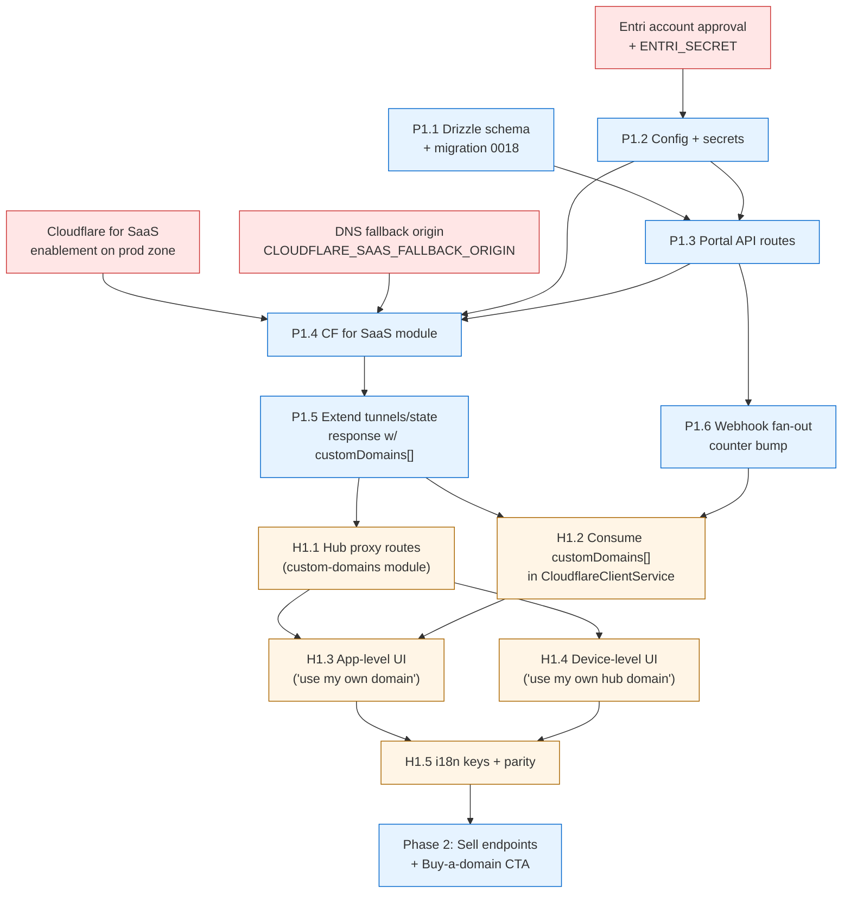

# Epic #472 — Custom Domain Support via Entri (Connect / Monitor / Sell)

**Issue:** [#472](https://github.com/companionintelligence/CI-Hub/issues/472)
**Status:** No code yet in CI-Hub; no sub-issues; epic body holds the full spec
**Coordinated repo:** CI-Portal (control plane; holds the Entri secret + Cloudflare for SaaS integration)
**Date:** 2026-05-18

---

## 1. At a Glance

| Dimension | Value |
|---|---|
| Phases | **Phase 1: Connect + Monitor** (MVP) → **Phase 2: Sell** (purchase in-product) |
| Total scope | New DB tables × 3 (Portal), new API routes × 8 (Portal) + 3 (Hub), webhook ingestion, modal integration, SSE plumbing |
| Cross-repo | Yes — CI-Portal owns >70% of the work |
| Hub-side estimate | **~3 weeks** for Phase 1, +**~1 week** for Phase 2 |
| Portal-side estimate | **~4–5 weeks** for Phase 1, +**~2 weeks** for Phase 2 |
| External dependencies | Entri account + `ENTRI_SECRET`, Cloudflare for SaaS enablement on the prod zone, fallback origin DNS |
| Risk profile | **High** — multi-system, third-party integration, real money in Phase 2 |

This is by far the most cross-cutting of the three open epics. Most coordination cost is in **Portal**, not Hub.

---

## 2. Goal

Let an organization owner:

1. **(Phase 1)** Connect an existing domain they already own — e.g. `home.acme.com`, `grafana.acme.com` — to their Hub or to an exposed app in one click, via the Entri Connect modal. DNS propagation + SSL readiness + ongoing drift detection are surfaced live in the Hub UI.
2. **(Phase 2)** Buy a brand-new domain through Entri Sell (IONOS / Squarespace resold) without leaving the Companion Intelligence UI and have it auto-wire to the device when the purchase completes.

All the user-private logic (`ENTRI_SECRET`, Cloudflare API calls, webhook signature verification, persistence) stays in Portal. Hub is the user-facing surface and a passthrough.

---

## 3. Why This Architecture

The epic body is unambiguous about a few decisions worth surfacing here:

| Decision | Rationale |
|---|---|
| Entri secret lives in **Portal only**, never in Hub | Hub is on user hardware; we cannot trust it to keep the secret. Hub requests a 60-min JWT from Portal per modal open. |
| Custom-domain DB lives in **Portal D1**, not Hub Postgres | Portal is what talks to Cloudflare. A Hub re-pair or re-install must not lose the customer's domain wiring; Portal is the durable home. |
| Modal opens from **both Portal and Hub** UIs | Org-wide management lives in Portal; per-app "expose at custom subdomain" lives contextually in Hub. Both call the same Portal endpoints. |
| Use **Cloudflare for SaaS / Custom Hostnames** for TLS, **not** Entri Power/Secure | TLS already terminates at our CF edge via the existing tunnel; Entri Power would duplicate the stack and add a hop. |
| Sync direction is **Hub → Portal POST**, not Portal → Hub push | `CloudflareClientService.syncState` in [`packages/backend/src/modules/cloudflare/cloudflare-client.service.ts`](../packages/backend/src/modules/cloudflare/cloudflare-client.service.ts) is the only existing channel. We piggyback `customDomains[]` onto its response body; webhook-driven re-syncs use a counter the Hub polls. |

---

## 4. Phase 1 — Connect + Monitor (MVP)

### 4.1 Portal workstream (CI-Portal repo)

#### P1.1 — Drizzle schema + migration
**Files:** `apps/hono-app/src/lib/db/schema/custom-domains.ts` (new), `apps/hono-app/src/lib/db/schema/index.ts` (export), `apps/hono-app/migrations/0018_*.sql` (generated)

Three tables (full SQL in epic body, summarized):
- **`custom_domain`** — one row per connected domain. FKs to `organization.id`, `device.device_id`, `application.id`.
- **`entri_webhook_event`** — append-only audit log of every Entri webhook (validated or not).
- **`entri_token_cache`** *(optional)* — per-(org, scope) JWT cache, TTL 60 min, only if perf needs it.

**Est:** 1–2 days.

#### P1.2 — Config & secrets
**Files:** `apps/hono-app/wrangler.jsonc` (`vars` block), Worker secrets via `wrangler secret put`

Add five config entries (per epic body):
- `ENTRI_APPLICATION_ID` — public-ish, `vars` block.
- `ENTRI_API_BASE` — `https://api.goentri.com`, `vars` block.
- `CLOUDFLARE_SAAS_FALLBACK_ORIGIN` — one-time per-zone fallback target, `vars` block.
- `ENTRI_SECRET` — Worker secret.
- `ENTRI_WEBHOOK_CLIENT_SECRET` — Worker secret (same value as `ENTRI_SECRET`).

Plus one-time Cloudflare setup:
- Enable **Cloudflare for SaaS** on the production zone.
- Configure `CLOUDFLARE_SAAS_FALLBACK_ORIGIN` to resolve to `<tunnelId>.cfargotunnel.com`.

**Est:** ~half day for code; **separate clock time** for Entri account approval + Cloudflare enablement.

#### P1.3 — Portal API routes
Eight new Hono endpoints (from epic body §"Portal — new routes"):

| Method | Path | Notes |
|---|---|---|
| `POST` | `/api/entri/token` | Mint 60-min JWT bound to applicationId/org/domain/records/product |
| `POST` | `/api/custom-domains/init` | Build `dnsRecords[]`, return `{ token, config }` for `entri.showEntri()`. Idempotent. |
| `POST` | `/api/custom-domains/:id/finalize` | Called after onSuccess. Persist `entri_job_id`, register CF for SaaS custom hostname, fan out to Hub. |
| `GET` | `/api/custom-domains` | List, filter by org/device/app |
| `GET` | `/api/custom-domains/:id` | Status incl. last webhook |
| `DELETE` | `/api/custom-domains/:id` | Remove CF custom hostname, optionally remove Entri Monitor, mark inactive |
| `POST` | `/api/custom-domains/:id/recheck` | Proxy `POST /connect/propagation/recheck/:job_id`, rate-limit 5min per job |
| `POST` | `/api/custom-domains/:id/check` | Server-side `POST /checkdomain?checkConflicts=true`, pre-modal conflict warning |
| `POST` | `/api/entri/webhooks` | **Webhook ingestion** — Signature V2 + 5min freshness + IP allowlist `3.14.77.245` |

**Est:** 1–2 weeks.

#### P1.4 — Cloudflare for SaaS custom hostname management
**Files:** new module `apps/hono-app/src/lib/cloudflare/saas-hostnames.ts`

Wrap the Cloudflare API for SSL-for-SaaS:
- `addCustomHostname(zoneId, hostname)` → returns CF hostname ID, stored on `custom_domain.cf_hostname_id`.
- `removeCustomHostname(zoneId, hostnameId)` for revocation.
- `getCustomHostnameStatus(zoneId, hostnameId)` for SSL state polling (fallback when webhook is delayed).

**Est:** 3–5 days.

#### P1.5 — Extend `POST /api/tunnels/state` response with `customDomains[]`
**Files:** existing tunnel state route in `apps/hono-app/src/routes/tunnels.ts` (or equivalent)

Currently returns `{ success }`. Extend to return:
```json
{
  "success": true,
  "customDomains": [
    {
      "id": "...",
      "domain": "grafana.acme.com",
      "applicationId": "...",
      "propagationStatus": "success",
      "sslStatus": "success",
      "monitorStatus": "success"
    }
  ]
}
```

Hub stores this per-app and renders in the dashboard.

**Est:** 2 days.

#### P1.6 — Webhook fan-out / SSE counter bump
**Files:** webhook handler (P1.3) writes to a counter the Hub polls.

Earlier drafts of #472 assumed Portal could push to Hub; the epic body explicitly corrects that ("There is no Portal→Hub push channel"). For Phase 1, **bump a counter on the org row when a webhook updates a domain**; Hub polls that counter or includes it in the next `/api/tunnels/state` round-trip and refreshes its cache when it changes.

Longer term: dedicated outbound channel (tracked separately, *not* part of this epic).

**Est:** 2–3 days.

### 4.2 Hub workstream (this repo)

#### H1.1 — Backend proxy routes
**Files:** new module `packages/backend/src/modules/custom-domains/` containing controller + service + module.

| Method | Path | Notes |
|---|---|---|
| `POST` | `/api/custom-domains/launch` | Thin proxy → Portal `init`. Adds local context (`application_id`, current exposure target) before forwarding. |
| `GET` | `/api/custom-domains` | Pull from Portal (cached briefly, refreshed when SSE fires or webhook counter bumps) |
| `DELETE` | `/api/custom-domains/:id` | Proxy to Portal |

**Touches:** the existing `CloudflareClientService` for the counter-bump-driven re-sync.

**Est:** 4–6 days.

#### H1.2 — Extend `CloudflareClientService.syncState` to consume `customDomains[]` from response
**Files:** [`packages/backend/src/modules/cloudflare/cloudflare-client.service.ts`](../packages/backend/src/modules/cloudflare/cloudflare-client.service.ts) (specifically the response handling around line 183)

After Portal's response, persist `customDomains[]` into a small in-memory cache; emit an SSE event when the list changes so the frontend can refresh.

**Est:** 2 days.

#### H1.3 — Dashboard UI — "Use my own domain" button per app
**Files:** likely [`packages/frontend/src/modules/app/components/dialogs/expose-app-dialog/`](../packages/frontend/src/modules/app/components/dialogs) (sibling to existing dialogs)

- Per-app "Use my own domain" button on the Expose dialog.
- Click → dynamically load `https://cdn.goentri.com/entri.js`.
- Call `POST /api/custom-domains/launch` to get JWT + config.
- Call `entri.showEntri(config)`.
- On `onSuccess(jobId)` callback → `POST /api/custom-domains/finalize` (which itself proxies to Portal).
- Show propagation / SSL / monitor status pulled from `GET /api/custom-domains`.

**Est:** 5–7 days.

#### H1.4 — Per-device "Use my own hub domain" button
**Files:** Settings page, hub-status component.

Same modal flow as H1.3 but with `target_kind: 'hub'` instead of `target_kind: 'app'`.

**Est:** 2–3 days.

#### H1.5 — i18n keys + parity guard
Add ~12 new translation keys (button labels, modal hints, status banners, error messages). The parity tests added in [PR #517](https://github.com/companionintelligence/CI-Hub/pull/517) and [PR #518](https://github.com/companionintelligence/CI-Hub/pull/518) ensure en/en-US stay in sync.

**Est:** half day.

### 4.3 Phase 1 totals

| Side | Workstream weeks (low) | Weeks (high) |
|---|---|---|
| Portal | 4 | 6 |
| Hub | 2.5 | 3.5 |
| Concurrent | — | — |
| **Net wall-clock if parallel** | **4** | **6** |

---

## 5. Phase 2 — Sell (purchase in-product)

Phase 2 is additive on Phase 1; the modal flow is similar but the JWT is minted with `purchaseDomain` baked in (with `freeDomain` for entitled orgs).

### Portal additions
- `POST /api/custom-domains/purchase/init` — new endpoint that mints a Sell-shaped JWT.
- Webhook handler updates: handle `domain.purchased` event type.
- Billing wiring — out of scope per epic body, but needs at least *visibility* (record that a domain came from Sell vs. Connect so finance can reconcile).
- **Sell Enterprise:** explicit non-goal per epic body (no own registrar relationship).

### Hub additions
- New "Buy a domain" CTA next to "Use my own domain" on the dashboard + Settings page.
- New `POST /api/custom-domains/purchase/launch` proxy route.

### Phase 2 totals

| Side | Weeks |
|---|---|
| Portal | 2 |
| Hub | 1 |
| **Net wall-clock** | **~2 weeks** if Phase 1 has shipped first |

---

## 6. Sequencing



### Practical sequencing

1. **Kick off external dependencies in parallel with code:** Entri account/secret, Cloudflare for SaaS enablement, fallback origin DNS. These have lead time outside our control.
2. **Portal P1.1 → P1.2 → (P1.3 || P1.4)** — schema + config first, then routes and CF integration in parallel.
3. **Portal P1.5 (extend tunnels/state response)** must land before Hub work can begin meaningfully (Hub-side cache depends on the response shape).
4. **Hub H1.1 → H1.2 → (H1.3 || H1.4)** — backend proxy first, then `CloudflareClientService` integration, then UI in either order.
5. **H1.5 i18n** is folded into each UI PR (no separate sequence).
6. **Phase 2** unblocked once Phase 1 has soaked in production for at least one release cycle.

---

## 7. Acceptance Criteria — Phase 1

- [ ] An org owner can click "Use my own domain" on an app, complete the Entri modal flow, and reach the app at `grafana.acme.com` within 10 minutes of confirmation.
- [ ] DNS propagation status is visible in the Hub UI and reflects reality within 60 seconds of a successful Entri webhook.
- [ ] SSL status (Cloudflare for SaaS) is visible and reflects reality within 5 minutes of a successful CF issuance.
- [ ] Drift detection: if a customer manually modifies their DNS to break the CNAME, the Hub UI shows the broken status within one Monitor cycle (~1 hour) and offers a one-click "fix" that re-runs the Entri flow.
- [ ] A Hub re-pair or re-install **does not lose** the connected domain — Portal is the durable record; Hub repopulates its cache on next `/api/tunnels/state` round-trip.
- [ ] `ENTRI_SECRET` never appears in any Hub-side log, response, or build artifact (verifiable by greppable secret-scanning in CI).
- [ ] Webhook signature validation rejects any payload with bad HMAC or >5 min old `Entri-Timestamp` header.
- [ ] Webhook source IP allowlist (`3.14.77.245`) is enforced in production; gated behind an env flag in staging so the Entri dashboard tester works.

---

## 8. Risks

| Risk | Likelihood | Impact | Mitigation |
|---|---|---|---|
| Entri SDK API changes mid-build | Med | Med | Pin to a specific `entri.js` build hash via CDN integrity hash; reference `/memories/repo/entri-developers-overview.md` for snapshot |
| Webhook IP `3.14.77.245` changes silently | Low | High | Monitor Entri changelog; have a runbook for adding new IPs at the Worker route |
| Cloudflare for SaaS quota or rate-limits | Low | Med | Start with a single test org; measure |
| Customer's DNS provider isn't on Entri's ~50-provider list → modal falls back to manual instructions; UX degradation | Med | Low | Surface "this provider needs manual setup" clearly; capture manual-mode completion rate as a metric |
| Hub-side cache of `customDomains[]` becomes stale (counter-bump miss) | Med | Med | Force-refresh on every dashboard mount; expose a "Refresh" button until we have a real push channel |
| Phase 2 introduces real money + refund / chargeback flows | High | High | Defer Phase 2 until billing model is solidified; do not let Phase 2 design dictate Phase 1 architecture |
| Concurrent webhook deliveries cause race in `custom_domain` row updates | Low | Med | All writes via `INSERT OR REPLACE` keyed on `custom_domain.id`; persist webhook event in append-only `entri_webhook_event` first, derive row from there |
| Phase 1 of #472 collides with the readiness/health contract from #420 | Med | Low | Land [#418 PR-02](epic-418-truth-contract-refactor.md) (readiness contract) first if possible; otherwise expose custom-domain SSL state via its own field rather than wedging it into a generic readiness enum |

---

## 9. Open Questions

1. **Entri sandbox availability?** The epic body notes `ENTRI_API_BASE` is overridable "for staging if Entri offers it". Confirm with Entri.
2. **Who pays for Cloudflare for SaaS?** Pricing is per-zone or per-hostname depending on plan. Confirm it's included in the existing CI Portal CF plan.
3. **Sell entitlement model** — the epic body mentions `freeDomain` baked into the JWT for entitled orgs. What entitles an org? Tied to a paid Companion plan?
4. **Apex domains** — the spec mostly assumes subdomain CNAMEs (`grafana.acme.com`). What's the story for apex (`acme.com`)? CNAME-flattening via CF works; needs to be tested.
5. **Monitor cycle** — Entri Monitor is described as hourly. Is that configurable? If a customer breaks DNS, do they wait up to an hour to see the broken state?
6. **Phase 2 Sell — billing source of truth** — Entri bills the org via IONOS/Squarespace? Or do we resell? The non-goal "no Sell Enterprise" implies we're a referrer, but billing UX needs a clear story.
7. **MCP integration** — the epic body marks "MCP: maybe — could expose `connect-domain` as a tool to our Hub agent later." Worth scoping a follow-up issue but not in this epic.
8. **What's the upgrade path** for existing orgs who already use the CI-managed subdomain — do they lose that subdomain if they connect a custom one, or is it additive?

---

## 10. Cross-Repo Coordination

This epic only ships if Portal ships first. Concrete asks for the Portal repo:

| Order | Portal deliverable | Required for Hub |
|---|---|---|
| 1 | `ENTRI_*` secrets in `wrangler.jsonc`, CF for SaaS enabled on prod zone | All Hub work |
| 2 | Drizzle migration `0018_*.sql` with `custom_domain`, `entri_webhook_event` tables | H1.2 (response consumption) |
| 3 | `POST /api/custom-domains/init` + `POST /api/custom-domains/launch`'s downstream | H1.1, H1.3, H1.4 |
| 4 | Extended `POST /api/tunnels/state` response with `customDomains[]` | H1.2, H1.3 (visible status) |
| 5 | Webhook ingestion + counter bump | H1.2 (refresh trigger) |

**Recommended:** open a CI-Portal tracking issue mirroring this plan so the two repos move in lockstep. The Hub work can stub on Portal endpoints early (Hub mocks `init`/`launch` returning a fake JWT) so UI work isn't blocked, but **end-to-end live verification requires Portal**.

---

## 11. Out of Scope (per epic body — restate so reviewers can hold the line)

- **Entri Power / Secure** — duplicates Cloudflare Tunnel + Cloudflare for SaaS, adds a hop.
- **Entri Sell Enterprise** — own-registrar relationship not warranted at current volume.
- **Bulk domain import / CSV uploads.**
- **Transfer-in via Sell Enterprise.**
- **Domain reseller billing model.**

If a PR proposes any of these, it doesn't belong in this epic.

---

## 12. References

- Epic: [#472](https://github.com/companionintelligence/CI-Hub/issues/472)
- Entri docs: [https://developers.entri.com/getting-started](https://developers.entri.com/getting-started)
- Reference memory file (per epic body): `/memories/repo/entri-developers-overview.md`
- Sibling repos: [CI-Portal](https://github.com/companionintelligence/CI-Portal) (most of the work lands here)
- Existing Hub-side touch point: [`packages/backend/src/modules/cloudflare/cloudflare-client.service.ts`](../packages/backend/src/modules/cloudflare/cloudflare-client.service.ts)
- Related Hub-side feature: [`feat/issue-231-public-domain-selection`](https://github.com/companionintelligence/CI-Hub/tree/feat/issue-231-public-domain-selection) — overlaps with the per-app domain selection UI
- Pre-req contracts: [#418 PR-02 readiness/health](epic-418-truth-contract-refactor.md) would simplify status modelling but is not strictly required
